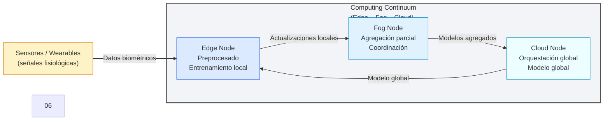

```mermaid
flowchart LR

%% --- Data Sources ---
Sensors["Sensores / Wearables<br/>(señales fisiológicas)"]

%% --- Computing Continuum ---
subgraph CC["Computing Continuum<br/>(Edge – Fog – Cloud)"]
    direction TB

    Edge["Edge Node<br/>Preprocesado<br/>Entrenamiento local"]
    Fog["Fog Node<br/>Agregación parcial<br/>Coordinación"]
    Cloud["Cloud Node<br/>Orquestación global<br/>Modelo global"]

    Edge -->|Actualizaciones locales| Fog
    Fog -->|Modelos agregados| Cloud
    Cloud -->|Modelo global| Edge
end

%% --- External flow ---
Sensors -->|Datos biométricos| Edge

%% --- Styling ---
style CC fill:#f2f4f8,stroke:#4a4a4a,stroke-width:2px
style Edge fill:#dbeafe,stroke:#2563eb
style Fog fill:#e0f2fe,stroke:#0284c7
style Cloud fill:#ecfeff,stroke:#0891b2
style Sensors fill:#fef3c7,stroke:#d97706
06

```
