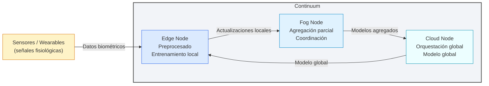

```mermaid
flowchart LR


%% -------------------------
%% Data source
%% -------------------------
Sensors["Sensores / Wearables<br/>(señales fisiológicas)"]

%% -------------------------
%% Continuum nodes
%% -------------------------
subgraph Continuum
  direction LR
  Edge["Edge Node<br/>Preprocesado<br/>Entrenamiento local"]
  Fog["Fog Node<br/>Agregación parcial<br/>Coordinación"]
  Cloud["Cloud Node<br/>Orquestación global<br/>Modelo global"]
end

%% -------------------------
%% Flows
%% -------------------------
Sensors -->|Datos biométricos| Edge
Edge -->|Actualizaciones locales| Fog
Fog -->|Modelos agregados| Cloud
Cloud -->|Modelo global| Edge


%% -------------------------
%% Styles
%% -------------------------
classDef title fill:#ffffff,stroke:#4a4a4a,stroke-width:2px,font-weight:bold;
classDef Continuum fill:#f2f4f8,stroke:#4a4a4a,stroke-width:2px;
classDef edge fill:#dbeafe,stroke:#2563eb;
classDef fog fill:#e0f2fe,stroke:#0284c7;
classDef cloud fill:#ecfeff,stroke:#0891b2;
classDef sensors fill:#fef3c7,stroke:#d97706;

class CC_Title title;
class Continuum Continuum;
class Edge edge;
class Fog fog;
class Cloud cloud;
class Sensors sensors;


```
