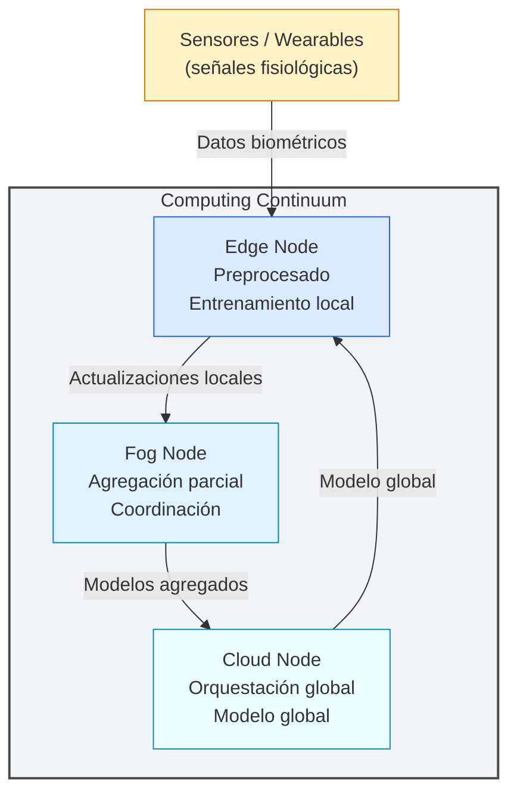
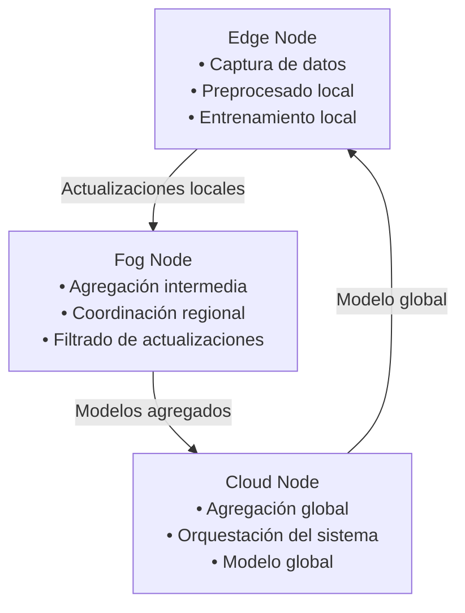
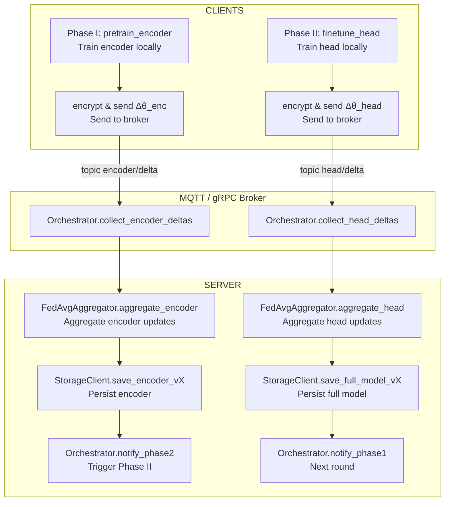
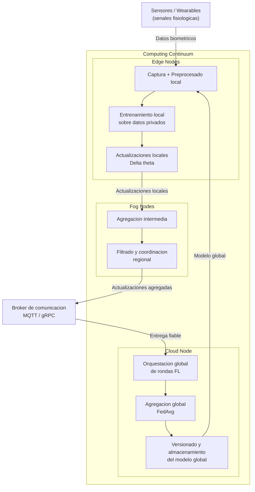

```mermaid
flowchart TB

%% -------------------------
%% Data source
%% -------------------------
Sensors["Sensores / Wearables<br/>(señales fisiológicas)"]

%% -------------------------
%% Computing Continuum
%% -------------------------
subgraph Continuum["Computing     Continuum<br/>(Edge – Fog – Cloud)"]
  direction TB
  Edge["Edge Node<br/>Preprocesado<br/>Entrenamiento local"]
  Fog["Fog Node<br/>Agregación parcial<br/>Coordinación"]
  Cloud["Cloud Node<br/>Orquestación global<br/>Modelo global"]
end

%% -------------------------
%% Flows
%% -------------------------
Sensors -->|Datos biométricos| Edge
Edge -->|Actualizaciones locales| Fog
Fog -->|Modelos agregados| Cloud
Cloud -->|Modelo global| Edge

%% -------------------------
%% Styles
%% -------------------------
classDef continuum fill:#f2f4f8,stroke:#4a4a4a,stroke-width:2px;
classDef edge fill:#dbeafe,stroke:#2563eb;
classDef fog fill:#e0f2fe,stroke:#0284c7;
classDef cloud fill:#ecfeff,stroke:#0891b2;
classDef sensors fill:#fef3c7,stroke:#d97706;

class Continuum continuum;
class Edge edge;
class Fog fog;
class Cloud cloud;
class Sensors sensors;


```

```mermaid
flowchart TB
    Edge["Edge Node<br/>• Captura de datos<br/>• Preprocesado local<br/>• Entrenamiento local"]
    Fog["Fog Node<br/>• Agregación intermedia<br/>• Coordinación regional<br/>• Filtrado de actualizaciones"]
    Cloud["Cloud Node<br/>• Agregación global<br/>• Orquestación del sistema<br/>• Modelo global"]

    Edge -->|Actualizaciones locales| Fog
    Fog -->|Modelos agregados| Cloud
    Cloud -->|Modelo global| Edge


```

```mermaid
flowchart TD
  subgraph CLIENTS
    direction TB
    A1[Phase I: pretrain_encoder<br/>Train encoder locally] --> A2[encrypt & send Δθ_enc<br/>Send to broker]
    A3[Phase II: finetune_head<br/>Train head locally]     --> A4[encrypt & send Δθ_head<br/>Send to broker]
  end

  subgraph BROKER["MQTT / gRPC Broker"]
    A2-->|topic encoder/delta|S1[Orchestrator.collect_encoder_deltas]
    A4-->|topic head/delta|S2[Orchestrator.collect_head_deltas]
  end

  subgraph SERVER
    S1-->AG1[FedAvgAggregator.aggregate_encoder<br/>Aggregate encoder updates]-->ST1[StorageClient.save_encoder_vX<br/>Persist encoder]
    ST1-->ORT1[Orchestrator.notify_phase2<br/>Trigger Phase II]

    S2-->AG2[FedAvgAggregator.aggregate_head<br/>Aggregate head updates]-->ST2[StorageClient.save_full_model_vX<br/>Persist full model]
    ST2-->ORT2[Orchestrator.notify_phase1<br/>Next round]
  end

```

```mermaid
flowchart TB

Sensors["Sensores / Wearables<br/>(senales fisiologicas)"]

subgraph Continuum["Computing Continuum<br/>(Edge-Fog-Cloud)"]
  direction TB

  subgraph EdgeLayer["Edge Nodes"]
    direction TB
    EdgeData["Captura + Preprocesado local"]
    EdgeTrain["Entrenamiento local<br/>sobre datos privados"]
    EdgeDelta["Actualizaciones locales<br/>Delta theta"]
    EdgeData --> EdgeTrain --> EdgeDelta
  end

  subgraph FogLayer["Fog Nodes"]
    direction TB
    FogAgg["Agregacion intermedia"]
    FogFilter["Filtrado y coordinacion<br/>regional"]
    FogAgg --> FogFilter
  end

  subgraph CloudLayer["Cloud Node"]
    direction TB
    CloudOrch["Orquestacion global<br/>de rondas FL"]
    CloudAgg["Agregacion global<br/>FedAvg"]
    CloudStore["Versionado y almacenamiento<br/>del modelo global"]
    CloudOrch --> CloudAgg --> CloudStore
  end
end

Broker["Broker de comunicacion<br/>MQTT / gRPC"]

Sensors -->|Datos biometricos| EdgeData
EdgeDelta -->|Actualizaciones locales| FogAgg
FogFilter -->|Actualizaciones agregadas| Broker
Broker -->|Entrega fiable| CloudOrch
CloudStore -->|Modelo global| EdgeData

classDef continuum fill:#f2f4f8,stroke:#4a4a4a,stroke-width:2px;
classDef sensors fill:#fef3c7,stroke:#d97706,stroke-width:


```
