# Diagrama de Clases - Arquitectura Flower-Basic

## 📊 Diagrama UML Completo

```mermaid
graph TB
    subgraph "FLOWER (Herencia)"
        FLClient["fl.client.NumPyClient"]
        FLServer["fl.server.strategy.FedAvg"]
    end

    subgraph "BASE"
        BaseMQTT["BaseMQTTComponent<br/>___<br/>+ mqtt: mqtt.Client<br/>+ tag: str<br/>+ _subscriptions: List<br/>___<br/>+ on_message(client, userdata, msg)<br/>+ publish_json(topic, payload)<br/>+ stop_mqtt()"]
    end

    subgraph "CLIENTES EDGE (MQTT)"
        SwellClient["SwellFLClientMQTT<br/>___<br/>+ node_dir: Path<br/>+ region: str<br/>+ model: SwellMLP<br/>+ train_loader: DataLoader<br/>+ global_model: dict<br/>___<br/>+ train_local()<br/>+ on_message(msg)<br/>+ publish_update()"]
        
        SweetClient["SweetFLClientMQTT<br/>___<br/>+ node_dir: Path<br/>+ region: str<br/>+ subject_id: str<br/>+ model: SweetMLP<br/>+ train_loader: DataLoader<br/>___<br/>+ train_local()<br/>+ on_message(msg)<br/>+ publish_update()"]
    end

    subgraph "CLIENTES FOG BRIDGE (Flower → MQTT)"
        FogBridgeSwell["FogClientSwell<br/>___<br/>+ server_address: str<br/>+ model: SwellMLP<br/>+ partial_weights: dict<br/>+ region: str<br/>___<br/>+ fit(parameters, config)<br/>+ get_parameters(config)<br/>+ on_message(msg)<br/>+ evaluate(parameters, config)"]
        
        FogBridgeSweet["FogClientSweet<br/>___<br/>+ server_address: str<br/>+ model: SweetMLP<br/>+ partial_weights: dict<br/>+ region: str<br/>___<br/>+ fit(parameters, config)<br/>+ get_parameters(config)<br/>+ on_message(msg)<br/>+ evaluate(parameters, config)"]
    end

    subgraph "BROKERS FOG (MQTT Aggregation)"
        FogBroker["fog.py (módulo)<br/>___<br/>+ buffers: Dict[region] → List<br/>+ clients_per_region: Dict<br/>+ K: int (threshold)<br/>___<br/>+ on_update(client, msg)<br/>+ weighted_average(updates, weights)<br/>+ MQTT: fl/updates → fl/partial"]
        
        SweetFogBroker["sweet_fog.py (módulo)<br/>___<br/>+ buffers: Dict[region] → List<br/>+ clients_per_region: Dict<br/>+ K: int (threshold)<br/>___<br/>+ on_update(client, msg)<br/>+ weighted_average(updates, weights)<br/>+ MQTT: fl/updates → fl/partial"]
    end

    subgraph "SERVIDORES CENTRALES (Flower)"
        SwellServer["MQTTFedAvgSwell : FedAvg<br/>___<br/>+ model: SwellMLP<br/>+ mqtt_client: mqtt.Client<br/>+ eval_data: Tuple<br/>+ total_rounds: int<br/>___<br/>+ configure_fit(rnd, parameters, ...)<br/>+ aggregate_fit(rnd, results, ...)<br/>+ evaluate(rnd, parameters, ...)<br/>+ publish_global_model()"]
        
        SweetServer["MQTTFedAvgSweet : FedAvg<br/>___<br/>+ model: SweetMLP<br/>+ mqtt_client: mqtt.Client<br/>+ eval_data: Tuple<br/>+ total_rounds: int<br/>___<br/>+ configure_fit(rnd, parameters, ...)<br/>+ aggregate_fit(rnd, results, ...)<br/>+ evaluate(rnd, parameters, ...)<br/>+ publish_global_model()"]
    end

    subgraph "MODELOS"
        SwellModel["SwellMLP : nn.Module<br/>___<br/>+ input_dim: int<br/>+ hidden_dim: int<br/>___<br/>+ forward(x)<br/>+ state_dict()"]
        
        SweetModel["SweetMLP : nn.Module<br/>___<br/>+ input_dim: int<br/>+ hidden_dims: List<br/>+ num_classes: int<br/>___<br/>+ forward(x)<br/>+ state_dict()"]
    end

    subgraph "MQTT TOPICS"
        Topic1["fl/updates<br/>(Clients → Broker)"]
        Topic2["fl/partial<br/>(Broker → Bridge)"]
        Topic3["fl/global_model<br/>(Server → All)"]
    end

    %% Herencia
    SwellClient -->|hereda| BaseMQTT
    SweetClient -->|hereda| BaseMQTT
    FogBridgeSwell -->|hereda| BaseMQTT
    FogBridgeSwell -->|hereda| FLClient
    FogBridgeSweet -->|hereda| BaseMQTT
    FogBridgeSweet -->|hereda| FLClient
    SwellServer -->|hereda| FLServer
    SweetServer -->|hereda| FLServer

    %% Composición
    SwellClient -->|usa| SwellModel
    SweetClient -->|usa| SweetModel
    FogBridgeSwell -->|usa| SwellModel
    FogBridgeSweet -->|usa| SweetModel
    SwellServer -->|usa| SwellModel
    SweetServer -->|usa| SweetModel

    %% Comunicación MQTT
    SwellClient -->|publica| Topic1
    SweetClient -->|publica| Topic1
    FogBroker -->|escucha| Topic1
    SweetFogBroker -->|escucha| Topic1
    FogBroker -->|publica| Topic2
    SweetFogBroker -->|publica| Topic2
    FogBridgeSwell -->|escucha| Topic2
    FogBridgeSweet -->|escucha| Topic2
    SwellServer -->|publica| Topic3
    SweetServer -->|publica| Topic3
    SwellClient -->|escucha| Topic3
    SweetClient -->|escucha| Topic3

    %% Comunicación Flower (gRPC)
    FogBridgeSwell -->|conecta a| SwellServer
    FogBridgeSweet -->|conecta a| SweetServer

    %% Agregación
    FogBroker -->|genera| Topic2
    SweetFogBroker -->|genera| Topic2

    style BaseMQTT fill:#e1f5ff
    style FLClient fill:#fff3e0
    style FLServer fill:#fff3e0
    style SwellClient fill:#f3e5f5
    style SweetClient fill:#f3e5f5
    style FogBridgeSwell fill:#e8f5e9
    style FogBridgeSweet fill:#e8f5e9
    style FogBroker fill:#fce4ec
    style SweetFogBroker fill:#fce4ec
    style SwellServer fill:#c8e6c9
    style SweetServer fill:#c8e6c9
    style SwellModel fill:#ffecb3
    style SweetModel fill:#ffecb3
```



---

## 🔗 Relaciones Detalladas

### **1. Herencia**

```
BaseMQTTComponent (abstracta)
├── SwellFLClientMQTT
├── SweetFLClientMQTT
├── FogClientSwell (también hereda de fl.client.NumPyClient)
└── FogClientSweet (también hereda de fl.client.NumPyClient)

fl.server.strategy.FedAvg (Flower)
├── MQTTFedAvgSwell
└── MQTTFedAvgSweet
```

### **2. Composición**

```
SwellFLClientMQTT
├── uses: SwellMLP (modelo)
├── uses: DataLoader (training data)
├── uses: mqtt.Client (vía BaseMQTTComponent)

SweetFLClientMQTT
├── uses: SweetMLP (modelo)
├── uses: DataLoader (training data)
├── uses: mqtt.Client (vía BaseMQTTComponent)

FogClientSwell
├── uses: SwellMLP (modelo)
├── uses: mqtt.Client (vía BaseMQTTComponent)

FogClientSweet
├── uses: SweetMLP (modelo)
├── uses: mqtt.Client (vía BaseMQTTComponent)

MQTTFedAvgSwell
├── uses: SwellMLP (modelo)
├── uses: mqtt.Client (publicar global model)

MQTTFedAvgSweet
├── uses: SweetMLP (modelo)
├── uses: mqtt.Client (publicar global model)
```

### **3. Comunicación MQTT**

```
CAPA EDGE (Clientes Locales)
├─ SwellFLClientMQTT ──→ publica/suscribe ──→ fl/updates (outgoing)
├─ SwellFLClientMQTT ──→ suscribe ──→ fl/global_model (incoming)
├─ SweetFLClientMQTT ──→ publica/suscribe ──→ fl/updates (outgoing)
└─ SweetFLClientMQTT ──→ suscribe ──→ fl/global_model (incoming)

CAPA FOG (Brokers Regionales)
├─ fog.py (módulo) ──→ suscribe ──→ fl/updates
└─ fog.py (módulo) ──→ publica ──→ fl/partial

CAPA FOG BRIDGE (Flower Clients)
├─ FogClientSwell ──→ suscribe ──→ fl/partial
├─ FogClientSwell ──→ publica (via Flower gRPC) ──→ servidor
├─ FogClientSweet ──→ suscribe ──→ fl/partial
└─ FogClientSweet ──→ publica (via Flower gRPC) ──→ servidor

CAPA CENTRAL (Servidor Flower)
├─ MQTTFedAvgSwell ──→ publica ──→ fl/global_model
└─ MQTTFedAvgSweet ──→ publica ──→ fl/global_model
```

### **4. Comunicación Flower (gRPC)**

```
FogClientSwell ──→ Flower gRPC ──→ MQTTFedAvgSwell
FogClientSweet ──→ Flower gRPC ──→ MQTTFedAvgSweet
```

---

## 📋 Tabla de Métodos Principales

### **BaseMQTTComponent**

| Método | Parámetros | Retorna | Descripción |
|--------|-----------|---------|-------------|
| `__init__` | `tag, mqtt_broker, mqtt_port, subscriptions` | `None` | Constructor base |
| `on_message` | `client, userdata, msg` | `None` | Hook para mensajes (override) |
| `publish_json` | `topic, payload` | `None` | Publica JSON en MQTT |
| `stop_mqtt` | | `None` | Desconecta cliente MQTT |

### **SwellFLClientMQTT / SweetFLClientMQTT**

| Método | Parámetros | Retorna | Descripción |
|--------|-----------|---------|-------------|
| `train_local` | `global_weights` | `dict, int` | Entrena localmente |
| `on_message` | `client, userdata, msg` | `None` | Recibe global model |
| `publish_update` | | `None` | Publica update a fog |

### **FogClientSwell / FogClientSweet**

| Método | Parámetros | Retorna | Descripción |
|--------|-----------|---------|-------------|
| `fit` | `parameters, config` | `List, int, dict` | Forwarding a servidor |
| `get_parameters` | `config` | `List` | Retorna parámetros actuales |
| `on_message` | `client, userdata, msg` | `None` | Recibe partial del broker |
| `evaluate` | `parameters, config` | `float, int, dict` | Evaluación |

### **fog.py / sweet_fog.py (Brokers)**

| Función | Parámetros | Retorna | Descripción |
|---------|-----------|---------|-------------|
| `on_update` | `client, userdata, msg` | `None` | Recibe update del cliente |
| `weighted_average` | `updates, weights` | `dict, dict` | Agregación FedAvg |

### **MQTTFedAvgSwell / MQTTFedAvgSweet (Servers)**

| Método | Parámetros | Retorna | Descripción |
|--------|-----------|---------|-------------|
| `configure_fit` | `rnd, parameters, client_manager` | `List, dict` | Configura ronda FL |
| `aggregate_fit` | `rnd, results, failures` | `tuple` | Agrega resultados |
| `evaluate` | `rnd, parameters` | `tuple` | Evalúa modelo global |
| `publish_global_model` | | `None` | Publica modelo en MQTT |

---

## 🎯 Flujo de Datos Completo

### **1. Cliente Edge → Fog Broker**

```python
# SwellFLClientMQTT.train_local()
weights = self.model.train(...)
msg = {
    "client_id": "swell_1",
    "region": "fog_0",
    "num_samples": 150,
    "weights": weights,  # Parámetros del modelo
}
self.mqtt.publish("fl/updates", json.dumps(msg))
```

### **2. Fog Broker → Fog Bridge**

```python
# fog.py: on_update()
buffers[region].append({"weights": w, "num_samples": n, ...})

# Cuando len(buffers[region]) >= K:
partial, stats = weighted_average([w1, w2, w3], [n1/N, n2/N, n3/N])
msg = {
    "region": "fog_0",
    "partial_weights": partial,  # Promedio ponderado
    "total_samples": 450,
}
self.mqtt.publish("fl/partial", json.dumps(msg))
```

### **3. Fog Bridge → Central Server**

```python
# FogClientSwell.fit(parameters, config)
# Espera partial del broker en MQTT
while self.partial_weights is None:
    time.sleep(0.5)

# Convierte a formato Flower
partial_list = [np.array(self.partial_weights[name]) for name in param_names]

# Retorna al servidor Flower
return partial_list, 1000, {}
```

### **4. Central Server → Global Broadcast**

```python
# MQTTFedAvgSwell.aggregate_fit()
# Agrega partiales de todos los bridges
global_weights = fl.server.strategy.weighted_average(results)

# Publica en MQTT
msg = {
    "round": current_round,
    "weights": global_weights,
}
self.mqtt_client.publish("fl/global_model", json.dumps(msg))
```

### **5. Global Model → Edge Clients**

```python
# SwellFLClientMQTT.on_message() (suscrito a fl/global_model)
data = json.loads(msg.payload)
self.global_model = data.get("weights")
# Siguiente ronda: usa estos pesos como initial
```

---

## 🔐 Aspectos Importantes

### **Herencia Múltiple (Fog Bridges)**

```python
class FogClientSwell(BaseMQTTComponent, fl.client.NumPyClient):
    # Hereda de ambas:
    # - BaseMQTTComponent: Comunicación MQTT
    # - fl.client.NumPyClient: Interfaz Flower
```

### **Strategy Pattern (Servidores)**

```python
class MQTTFedAvgSwell(fl.server.strategy.FedAvg):
    # Extiende FedAvg con capacidad de publicar en MQTT
    
    def aggregate_fit(self, rnd, results, failures):
        # Llama a super().aggregate_fit()
        aggregated = super().aggregate_fit(rnd, results, failures)
        
        # Luego publica
        self.publish_global_model(aggregated)
        return aggregated
```

### **Template Method (Clientes)**

```python
class SwellFLClientMQTT(BaseMQTTComponent):
    # BaseMQTTComponent define on_message como hook
    # Cada cliente implementa su propia lógica en on_message()
    
    def on_message(self, client, userdata, msg):
        # SwellFLClientMQTT: procesa global model
        data = json.loads(msg.payload)
        self.global_model = data.get("weights")
```

---

## 📦 Dependencias de Clases

```
StandardLibrary
├── json
├── threading
├── time
└── ...

PyTorch
├── torch
├── torch.nn (SwellMLP, SweetMLP)
└── torch.utils.data (DataLoader)

Flower
├── flwr.client.NumPyClient
├── flwr.server.strategy.FedAvg
└── flwr.server.strategy.Strategy

Paho MQTT
└── paho.mqtt.client (mqtt.Client)

NumPy
└── numpy (aggregation)

Custom
├── flower_basic.clients.baseclient (BaseMQTTComponent)
├── flower_basic.swell_model (SwellMLP)
├── flower_basic.sweet_model (SweetMLP)
├── flower_basic.datasets.swell_federated
└── flower_basic.datasets.sweet_federated
```

