```plantuml
@startuml Flower-Basic_Architecture

!define ABSTRACT abstract

scale 1.5
skinparam linetype ortho
skinparam classBackgroundColor #FFFFCC
skinparam classBorderColor #333333

' ============================================================================
' EXTERNAL DEPENDENCIES / INTERFACES
' ============================================================================

package "Flower Framework" {
    interface "<<interface>>\nNumPyClient" as INumPyClient {
        {abstract} +fit(parameters: List<ndarray>, config: dict): Tuple<List<ndarray>, int, dict>
        {abstract} +get_parameters(config: dict): List<ndarray>
        {abstract} +evaluate(parameters: List<ndarray>, config: dict): Tuple<float, int, dict>
    }
    
    class "FedAvg\n(Strategy)" as FedAvg {
        {abstract} #configure_fit(rnd: int, parameters: List, client_manager): Tuple<List, dict>
        {abstract} #aggregate_fit(rnd: int, results: List, failures: List): Tuple
        {abstract} #evaluate(rnd: int, parameters: List): Tuple
    }
}

package "MQTT / Paho" {
    class "mqtt.Client" as MQTTClient {
        -_sock: socket
        -_messages_reconnect_min: int
        -_messages_reconnect_max: int
        +connect(host: str, port: int, keepalive: int): None
        +disconnect(): None
        +publish(topic: str, payload: str | bytes): None
        +subscribe(topic: str): None
        +loop_start(): None
        +loop_stop(): None
        +on_connect: Callable
        +on_message: Callable
    }
}

package "PyTorch" {
    class "nn.Module" as NNModule {
        {abstract} +forward(x: Tensor): Tensor
        +state_dict(): dict
        +load_state_dict(state_dict: dict): None
    }
}

' ============================================================================
' BASE COMPONENTS
' ============================================================================

package "Base Components" {
    abstract class "BaseMQTTComponent" as BaseMQTT {
        #tag: str
        #mqtt: mqtt.Client
        #_subscriptions: List<str>
        +__init__(tag: str, mqtt_broker: str, mqtt_port: int, subscriptions: List<str>): void
        {abstract} +on_message(client: mqtt.Client, userdata: any, msg: MQTTMessage): void
        +publish_json(topic: str, payload: dict): void
        +stop_mqtt(): void
        #_on_connect_wrapper(client, userdata, flags, rc, properties): void
        #_on_message_wrapper(client, userdata, msg): void
    }
    
    BaseMQTT *-- MQTTClient : uses
}

' ============================================================================
' MODELS
' ============================================================================

package "Models" {
    class "SwellMLP" as SwellMLPModel {
        -input_dim: int
        -hidden_dim: int = 64
        -output_dim: int = 1
        -fc1: Linear
        -fc2: Linear
        -dropout: Dropout
        +__init__(input_dim: int, hidden_dim: int = 64): void
        +forward(x: Tensor): Tensor
    }
    
    class "SweetMLP" as SweetMLPModel {
        -input_dim: int
        -hidden_dims: List<int>
        -num_classes: int
        -layers: ModuleList
        -dropout: Dropout
        -activation: ReLU
        +__init__(input_dim: int, hidden_dims: List<int>, num_classes: int): void
        +forward(x: Tensor): Tensor
    }
    
    SwellMLPModel --|> NNModule
    SweetMLPModel --|> NNModule
}

' ============================================================================
' DATASETS & DATA LOADERS
' ============================================================================

package "Data" {
    class "DataLoader" as DataLoaderClass {
        -dataset: Dataset
        -batch_size: int
        -shuffle: bool
        -num_workers: int
        +__iter__(): Iterator
        +__len__(): int
    }
    
    class "Dataset" as PyTorchDataset {
        {abstract} +__getitem__(index: int): Tuple<Tensor, Tensor>
        {abstract} +__len__(): int
    }
    
    DataLoaderClass *-- PyTorchDataset : iterates
}

' ============================================================================
' EDGE LAYER (CLIENTS)
' ============================================================================

package "Edge Layer - Local Clients" {
    abstract class "SwellFLClientMQTT" as SwellClient {
        -node_dir: Path
        -region: str
        -tag: str
        -model: SwellMLP
        -train_loader: DataLoader
        -val_loader: DataLoader
        -test_loader: DataLoader
        -device: str
        -global_model: dict
        -optimizer: torch.optim.Adam
        -criterion: nn.BCEWithLogitsLoss
        -lr: float
        -batch_size: int
        -num_rounds: int
        -topic_updates: str
        -topic_global: str
        +__init__(node_dir: str, region: str, lr: float, batch_size: int, ...): void
        +train_local(): Tuple<dict, int>
        +on_message(client: mqtt.Client, userdata: any, msg: MQTTMessage): void
        +publish_update(): void
        +process_global_weights(weights: dict): void
        +run_rounds(total_rounds: int): void
        -_load_data(): void
    }
    
    abstract class "SweetFLClientMQTT" as SweetClient {
        -node_dir: Path
        -region: str
        -subject_id: str
        -tag: str
        -model: SweetMLP
        -train_loader: DataLoader
        -val_loader: DataLoader
        -test_loader: DataLoader
        -device: str
        -global_model: dict
        -optimizer: torch.optim.Adam
        -criterion: nn.CrossEntropyLoss
        -lr: float
        -batch_size: int
        -local_epochs: int
        -num_rounds: int
        -topic_updates: str
        -topic_global: str
        +__init__(node_dir: str, region: str, input_dim: int, hidden_dims: List<int>, ...): void
        +train_local(): Tuple<dict, int>
        +on_message(client: mqtt.Client, userdata: any, msg: MQTTMessage): void
        +publish_update(): void
        +process_global_weights(weights: dict): void
        +run_rounds(total_rounds: int): void
        -_load_data(): void
    }
    
    SwellClient --|> BaseMQTT
    SweetClient --|> BaseMQTT
    
    SwellClient *-- SwellMLPModel : uses
    SweetClient *-- SweetMLPModel : uses
    
    SwellClient *-- DataLoaderClass : trains with
    SweetClient *-- DataLoaderClass : trains with
}

' ============================================================================
' FOG LAYER - BROKER (AGGREGATION)
' ============================================================================

package "Fog Layer - Brokers" {
    class "FogBroker\n(fog.py)" as FogBrokerClass {
        {static} -buffers: Dict<str, List>
        {static} -clients_per_region: Dict<str, Set<str>>
        {static} -K: int = 3
        {static} -K_MAP: Dict<str, int>
        {static} -UPDATE_TOPIC: str = "fl/updates"
        {static} -PARTIAL_TOPIC: str = "fl/partial"
        {static} -mqtt_client: mqtt.Client
        +{static} on_update(client: mqtt.Client, userdata: any, msg: MQTTMessage): void
        +{static} weighted_average(updates: List<dict>, weights: List<float>): Tuple<dict, dict>
        +{static} main(): void
    }
    
    class "SweetFogBroker\n(sweet_fog.py)" as SweetFogBrokerClass {
        {static} -buffers: Dict<str, List>
        {static} -clients_per_region: Dict<str, Set<str>>
        {static} -K: int = 1
        {static} -K_MAP: Dict<str, int>
        {static} -UPDATE_TOPIC: str = "fl/updates"
        {static} -PARTIAL_TOPIC: str = "fl/partial"
        {static} -mqtt_client: mqtt.Client
        +{static} on_update(client: mqtt.Client, userdata: any, msg: MQTTMessage): void
        +{static} weighted_average(updates: List<dict>, weights: List<float>): Tuple<dict, dict>
        +{static} main(): void
    }
    
    FogBrokerClass *-- MQTTClient : uses
    SweetFogBrokerClass *-- MQTTClient : uses
    
    note right of FogBrokerClass
        Aggregates K client updates
        via weighted average (NumPy)
        Publishes to fog bridges
    end note
}

' ============================================================================
' FOG LAYER - BRIDGE CLIENTS
' ============================================================================

package "Fog Layer - Bridge Clients" {
    class "FogClientSwell" as FogBridgeSwell {
        -server_address: str
        -region: str
        -model: SwellMLP
        -param_names: List<str>
        -partial_weights: dict
        -partial_trace_context: dict
        -partial_topic: str
        -timeout: int = 60
        +__init__(server_address: str, input_dim: int, region: str, ...): void
        +fit(parameters: List<ndarray>, config: dict): Tuple<List<ndarray>, int, dict>
        +get_parameters(config: dict): List<ndarray>
        +evaluate(parameters: List<ndarray>, config: dict): Tuple<float, int, dict>
        +on_message(client: mqtt.Client, userdata: any, msg: MQTTMessage): void
        -_wait_for_partial(): bool
        -_convert_partial_to_numpy(): List<ndarray>
    }
    
    class "FogClientSweet" as FogBridgeSweet {
        -server_address: str
        -region: str
        -model: SweetMLP
        -param_names: List<str>
        -partial_weights: dict
        -partial_trace_context: dict
        -partial_topic: str
        -timeout: int = 60
        +__init__(server_address: str, input_dim: int, hidden_dims: List<int>, region: str, ...): void
        +fit(parameters: List<ndarray>, config: dict): Tuple<List<ndarray>, int, dict>
        +get_parameters(config: dict): List<ndarray>
        +evaluate(parameters: List<ndarray>, config: dict): Tuple<float, int, dict>
        +on_message(client: mqtt.Client, userdata: any, msg: MQTTMessage): void
        -_wait_for_partial(): bool
        -_convert_partial_to_numpy(): List<ndarray>
    }
    
    FogBridgeSwell --|> BaseMQTT
    FogBridgeSwell --|> INumPyClient
    FogBridgeSwell *-- SwellMLPModel : uses
    
    FogBridgeSweet --|> BaseMQTT
    FogBridgeSweet --|> INumPyClient
    FogBridgeSweet *-- SweetMLPModel : uses
    
    note right of FogBridgeSwell
        Receives aggregated partials
        from fog broker via MQTT
        Forwards to Flower server
    end note
}

' ============================================================================
' CENTRAL LAYER - SERVERS
' ============================================================================

package "Central Layer - Servers" {
    class "MQTTFedAvgSwell" as SwellServer {
        -model: SwellMLP
        -mqtt_client: mqtt.Client
        -eval_data: Tuple<ndarray, ndarray>
        -test_data: Tuple<ndarray, ndarray>
        -total_rounds: int
        -current_round: int = 0
        -model_topic: str = "fl/global_model"
        +__init__(model: SwellMLP, mqtt_client: mqtt.Client, eval_data: Tuple, ...): void
        +configure_fit(rnd: int, parameters: List, client_manager): Tuple<List, dict>
        +aggregate_fit(rnd: int, results: List, failures: List): Tuple<Tuple, dict>
        +evaluate(rnd: int, parameters: List): Tuple<float, dict>
        +publish_global_model(weights: dict): void
        -_evaluate_on_testset(parameters: List): Tuple<float, float>
    }
    
    class "MQTTFedAvgSweet" as SweetServer {
        -model: SweetMLP
        -mqtt_client: mqtt.Client
        -eval_data: Tuple<ndarray, ndarray>
        -test_data: Tuple<ndarray, ndarray>
        -total_rounds: int
        -current_round: int = 0
        -model_topic: str = "fl/global_model"
        +__init__(model: SweetMLP, mqtt_client: mqtt.Client, eval_data: Tuple, ...): void
        +configure_fit(rnd: int, parameters: List, client_manager): Tuple<List, dict>
        +aggregate_fit(rnd: int, results: List, failures: List): Tuple<Tuple, dict>
        +evaluate(rnd: int, parameters: List): Tuple<float, dict>
        +publish_global_model(weights: dict): void
        -_evaluate_on_testset(parameters: List): Tuple<float, float>
    }
    
    SwellServer --|> FedAvg
    SwellServer *-- SwellMLPModel : uses
    SwellServer *-- MQTTClient : uses
    
    SweetServer --|> FedAvg
    SweetServer *-- SweetMLPModel : uses
    SweetServer *-- MQTTClient : uses
    
    note right of SwellServer
        Extends Flower FedAvg
        with MQTT publishing
        for global model broadcast
    end note
}

' ============================================================================
' COMMUNICATION FLOWS
' ============================================================================

package "MQTT Communication" {
    interface "<<MQTT Topic>>\nfl/updates" as TopicUpdates {
        -schema: {client_id, region, num_samples, weights}
    }
    
    interface "<<MQTT Topic>>\nfl/partial" as TopicPartial {
        -schema: {region, partial_weights, total_samples}
    }
    
    interface "<<MQTT Topic>>\nfl/global_model" as TopicGlobal {
        -schema: {round, weights, accuracy, loss}
    }
}

package "Flower Communication" {
    interface "<<gRPC>>\nFlower Protocol" as FlowerGRPC {
        +fit(parameters, config)
        +evaluate(parameters, config)
    }
}

' ============================================================================
' RELATIONSHIPS & ASSOCIATIONS
' ============================================================================

' Edge -> Fog Broker (MQTT)
SwellClient "publishes\nupdate" --> TopicUpdates
SweetClient "publishes\nupdate" --> TopicUpdates

TopicUpdates --> FogBrokerClass : "subscribes"
TopicUpdates --> SweetFogBrokerClass : "subscribes"

' Fog Broker -> Fog Bridge (MQTT)
FogBrokerClass "publishes\npartial" --> TopicPartial
SweetFogBrokerClass "publishes\npartial" --> TopicPartial

TopicPartial --> FogBridgeSwell : "subscribes"
TopicPartial --> FogBridgeSweet : "subscribes"

' Fog Bridge -> Central Server (Flower gRPC)
FogBridgeSwell "connects via" --> FlowerGRPC
FogBridgeSweet "connects via" --> FlowerGRPC

FlowerGRPC --> SwellServer : "communicates"
FlowerGRPC --> SweetServer : "communicates"

' Central Server -> Edge Clients (MQTT)
SwellServer "publishes\nglobal model" --> TopicGlobal
SweetServer "publishes\nglobal model" --> TopicGlobal

TopicGlobal --> SwellClient : "subscribes"
TopicGlobal --> SweetClient : "subscribes"

' ============================================================================
' LEGEND
' ============================================================================

note bottom : "SWELL Architecture: Edge Clients → Fog Broker → Fog Bridge → Central Server\nSWEET Architecture: Similar but with different model and aggregation strategy"

@enduml
```

**Diagrama UML - PlantUML Format**

Puedes usar este código en:
- **PlantUML Online**: www.plantuml.com/plantuml/uml/
- **VS Code Extension**: plantUML
- **Generadores UML**: lucidchart, draw.io

**Características del Diagrama:**

✅ **Clases Concretas**: Todos los componentes principales
✅ **Interfaces**: NumPyClient, MQTT Topics, gRPC
✅ **Herencia**: Relaciones directas de extensión
✅ **Composición**: Relaciones "uses" (*)
✅ **Métodos**: Todos los métodos públicos y privados clave
✅ **Atributos**: Tipos de datos completos
✅ **Paquetes**: Organizados por capas arquitectónicas
✅ **Flujo de Comunicación**: Asociaciones con etiquetas

**Capas Representadas:**
1. **Edge Layer**: SwellFLClientMQTT, SweetFLClientMQTT
2. **Fog Broker Layer**: FogBroker, SweetFogBroker
3. **Fog Bridge Layer**: FogClientSwell, FogClientSweet
4. **Central Layer**: MQTTFedAvgSwell, MQTTFedAvgSweet
