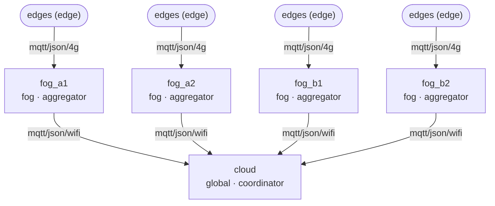

# Onion-FL

A framework to experiment with hierarchical federated learning (edge → fog → … → cloud): trees of any depth, fogs that mix datasets, pluggable learning techniques, a virtual-clock simulator and real runs over MQTT, with every level instrumented. It grew out of a stress-detection project on wearable and workplace data (SWELL, SWEET, WESAD) and is a master's thesis (TFM) prototype.

[](https://github.com/adrianoggm/Onion-FL/actions/workflows/ci.yml)


> **About this README.** It describes the redesigned framework as of v0.4.0 (October 2026), which adds federated learning techniques (personalisation, drift correction, robust aggregation and privacy, server optimizers and buffering) to the Onion-FL Studio of v0.3.0 and the framework of v0.2.0. Every number in it comes from a file in the repository, cited next to it. The datasets are not in git. SWELL-KW and WESAD were downloaded and checked against their descriptors in October 2026, and the first results of the new framework on real data are in [§7](#7-results). SWEET is still unchecked. [§1](#1-status) says exactly what is verified and how.

## Contents

1. [Status](#1-status)
2. [Quick start](#2-quick-start)
3. [How it works](#3-how-it-works)
4. [Experiments](#4-experiments)
5. [Datasets](#5-datasets)
6. [Observability](#6-observability)
7. [Results](#7-results)
8. [Repository map](#8-repository-map)
9. [Development and CI](#9-development-and-ci)
10. [Known limitations](#10-known-limitations)
11. [Roadmap](#11-roadmap)
12. [Project history](#12-project-history)
13. [License and acknowledgments](#13-license-and-acknowledgments)

---

## 1. Status

### At a glance

| Area | Status | Summary |
|---|---|---|
| Topologies | ✅ | Trees of any depth in YAML (compact or general form), each with a `topology_id` (SHA-256 of its structure and links) and a JSON/Mermaid graph |
| Data | ✅ / ⚠️ | Declarative ingestion (readers and steps), a signed cache, subject roles fixed across scenarios, and placement plugins. The SWELL and WESAD descriptors are checked against the published files and the loaders from before the redesign; **SWEET is not** ([§5](#5-datasets)) |
| Learning | ✅ | Modular model (adapter per dataset, shared or per-dataset trunk, head per task or dataset). Sharing scopes: global, per level, local. Per-key aggregators and server optimizers; trainers `standard`, `fedprox`; for personalisation `ditto`, `apfl`, `fedrep`, `fedbabu` and the `lg_fedavg` sharing preset; for non-IID drift `scaffold`, `moon`, and the trainer + server optimizer pairs `fednova` and `feddyn`. Algorithms exchange extra state (control variates) as auxiliary arrays, and the server optimizer gets each round's statistics (steps, edges). Robust aggregators (`krum`, `multi_krum`, `bulyan`, `geometric_median`, `norm_clip`), central and local differential privacy (`dp_fedavg`, `local_dp`) with ε per round, and an attack axis (`label_flip`, `sign_flip`, `gaussian`, `scale`) on a seeded fraction of edges. Edges also score personal and fine-tuned models; random or checkpoint init |
| Round protocol | ✅ | Coordinator, aggregators at any level, edges and evaluators. Registration with acknowledged `hello`, quorum and deadline, staleness and participation plugins, per-key weights, evaluation at edge, zone and global level |
| Simulation | ✅ | Virtual clock; links with latency, jitter, bandwidth and loss; compute and availability models; deterministic for a seed |
| Real runs | ✅ | One process per aggregator over MQTT; a manual `onion_fl node` start for several machines. Verified locally against Mosquitto: 3 processes, every message delivered, latencies measured, and the same final model as the simulation |
| Observability | ✅ | `runs/<run_id>/` with signed events, summary and final model. Diagnostics at every aggregator; analysis API with mean ± CI over seeds; HTML report; Prometheus and OpenTelemetry sinks; Grafana dashboard |
| CLI | ✅ | `onion_fl data · topology · plan · run · node · report · baseline · schema · serve` |
| Studio | ✅ | `onion_fl serve`: the topology library and editor; experiments with their plan and launch; a live run monitor; comparisons between topologies and scenarios per level; and a tutorial with dry-run previews ([§6](#6-observability)) |
| Continuum | ✅ / ⚠️ | Every simulated run writes a signed bundle, and a later run continues it exactly (`init: run`). Edges can be fed by streams: rows in time order, a labelled fraction, delayed labels, test-then-train scoring. Replay memory, triggers and versions are next (C4–C7, [#159](https://github.com/adrianoggm/Onion-FL/issues/159)–[#163](https://github.com/adrianoggm/Onion-FL/issues/163)) |
| gRPC and Flower transports, distributed deployment | ❌ | Planned (E5 [#104](https://github.com/adrianoggm/Onion-FL/issues/104), E6 [#105](https://github.com/adrianoggm/Onion-FL/issues/105)) |
| Tests | ✅ | 1026 tests. With SWELL, WESAD and a local broker, 1022 pass and 4 skip: SWEET (2) and the optional Excel and Parquet readers. The CI starts a broker but has no data, so the data-dependent tests skip there |

### What the results can and can't support today

- **Nine experiments of the new framework have run on real data**, all committed in [§7](#7-results). They are the SWELL reference run, a SWELL + WESAD mixing sweep, the comparisons of personalisation, drift, robustness, privacy and server-side techniques, the continuation of a trained model, and a stream replay of SWELL + WESAD. Each has three seeds, so many intervals overlap.
  - The reference run and the mixing sweep have no strong result. On SWELL, no model beats always predicting "stress" on the held-out subjects. On WESAD, the federated model reaches 0.77 accuracy where centralised logistic regression reaches 0.91.
  - In the technique comparisons, the clearest effects are on WESAD: FedDyn and SCAFFOLD beat FedAvg under drift, the adaptive server optimizers beat it too, and a strong sign-flip attack collapses FedAvg while norm clipping holds.
- **Checking the data found real problems,** now fixed. 999 means "missing" in the SWELL physiology file, for 53% of the heart-rate values, and both the old and the new loaders read it as a value. The facial and physiology joins and the WESAD chest signals `Resp` and `Temp` failed to load. The SWELL posture file has every date a month early, so posture is left out.
- **Tests that need data** skip without `data/` ([docs/RULES.md](docs/RULES.md)). Protocol tests use a stub trainer that learns nothing.
- **Legacy numbers stay legacy.** [§7](#7-results) lists the baselines from before the redesign with their caveats. Some of them predate the `blok` leak fix.
- **The real-data-only rule holds.** Two old preprocessing scripts once wrote `np.random` values under the real SWELL file names. Both are deleted; if either ran on your machine, restore `data/SWELL/` from the original download. The dataset card (`onion_fl data inspect`) flags any feature whose correlation with the label is above 0.95.

---

## 2. Quick start

### Install

Python 3.11. The repository uses a `.venv` created with [uv](https://docs.astral.sh/uv/):

```bash
uv venv .venv --python 3.11
uv pip install --python .venv torch --index-url https://download.pytorch.org/whl/cpu
uv pip install --python .venv -e ".[dev]"        # add ",analysis" for XGBoost
```

Or run `just install-dev`. The command line is `onion_fl` (also `python -m onion_fl`).

### Put the data in place

The data is not in git. Download each dataset from its source and place it where its descriptor in `datasets/` expects it:

| Dataset | Source | Path | Descriptor |
|---|---|---|---|
| SWELL-KW | [DANS](https://doi.org/10.17026/dans-x55-69zp), open access: the 11 files of `3 - Feature dataset/per sensor` (18 MB; download the two `.tab` files in their original format, CSV) | `data/SWELL/3 - Feature dataset/per sensor/` | `datasets/swell.yaml` (computer file; facial and physiology as options), `datasets/swell_physiology.yaml` |
| SWEET | — | `data/SWEET/{sample_subjects,selection1/users,selection2/users}/<user>/` | `datasets/sweet.yaml` |
| WESAD | [University of Siegen](https://uni-siegen.sciebo.de/s/HGdUkoNlW1Ub0Gx) (`WESAD.zip`, 2.2 GB; publications must cite Schmidt et al., 2018); extract the `S<n>/S<n>.pkl` files (13 GB) into `data/` | `data/WESAD/S<n>/S<n>.pkl` | `datasets/wesad.yaml` |

### Run

```bash
onion_fl data inspect swell                   # dataset card: subjects, classes, missing values, leak warnings
onion_fl topology show topologies/four_fogs.yaml
onion_fl plan experiments/mix_ab.yaml         # composition per fog and groups per link, no training
onion_fl run experiments/mix_ab.yaml --workers 3
onion_fl report experiments/mix_ab.yaml --by topology_id --by scenario
onion_fl baseline experiments/mix_ab.yaml     # LR, RF, XGBoost on the same test subjects
```

For a real run over MQTT, start the stack (`just docker-up`, [docker/README.md](docker/README.md)), point the links at the broker and run `onion_fl run <experiment> --mode real`.

### Studio

```bash
uv pip install --python .venv -e ".[studio]"   # FastAPI and uvicorn (already in dev)
onion_fl serve                                  # http://127.0.0.1:8765
```

The Studio reads and writes the same files as the command line (`topologies/`, `experiments/`, `runs/`). It has five areas:
- **Topologies:** the library, the graph and an editor that validates as you type.
- **Experiments:** scenarios, the dry-run plan (composition per fog, groups per link, warnings) and a launch button.
- **Runs:** status, identity, metrics per level and live events.
- **Compare:** mean ± CI over seeds, by topology, scenario or dataset.
- **Tutorial:** every plugin explained, with previews of sharing, placement and network profiles.

---

## 3. How it works

The full design is in [docs/architecture.md](docs/architecture.md). In short:



*`topologies/four_fogs.yaml`, drawn with `onion_fl topology show --mermaid`; the graphs are in [docs/diagrams/](docs/diagrams/).*

| Layer | What it does |
|---|---|
| `core` | `Message` and codecs (`json`, `npz`), `Node` (a state machine) and `Context` (its only way out), topologies and identifiers, plugin registries |
| `data` | Descriptors → cache → `SubjectData` per subject → roles (test, val, train, local_val, clients, scaling fitted on train only) → placement under the leaf aggregators |
| `learning` | Modular model with namespaced keys (`adapter.<ds>`, `trunk`, `head.<task>`), sharing scopes, aggregators, server optimizers, trainers, inits, metrics |
| `roles` | Coordinator, aggregators and edges. Every round sends each link only the groups its scope lets through; weights travel per key, so a tree of FedAvg equals a flat FedAvg |
| `runtime` | `SimRuntime` (virtual clock) and `RealRuntime` (wall clock); both drive the same nodes |
| `transports` | `memory` and `mqtt` (one inbox per node, QoS and broker per link) |
| `observability` | Events, run identity and signature, diagnostics, analysis, report, sinks |
| `experiment` | Config, sweeps, the dry-run plan, the runner and the CLI |

Every experimental axis is a plugin chosen by name in the config, and new ones are registered without touching the core: placement, transport, codec, aggregator, trainer, server optimizer, sharing, model, init, metric, diagnostic, participation, staleness and sink. `onion_fl schema` exports the config's JSON Schema with the catalogue of every plugin and its parameters.

---

## 4. Experiments

An experiment names a topology, the data, the learning setup, the rounds, the evaluation and the runtime, plus seeds and a sweep. `experiments/mix_ab.yaml` takes SWELL and SWEET over four fogs from segregated (α = 0) to fully mixed (α = 1):

```yaml
name: mix_ab
topology: four_fogs
data:
  datasets: {swell: {}, sweet: {options: {label: binary}}}
  roles: {test: 0.2, val: 0.1, local_val: 0.2, scaler: global, seed: 0}
  placement: {name: mixing, alpha: 0.0}
learning:
  model: {name: modular_mlp, adapter_width: 64, trunk_hidden: [64, 32]}
  sharing: fedavg
  trainer: {name: standard, local_epochs: 1, lr: 0.001}
rounds: 20
evaluation: {metrics: [loss, accuracy, macro_f1], edge: {every: 5}, aggregators: {every: 5}, global: {every: 1}}
seeds: [0, 1, 2]
sweep: {data.placement.alpha: [0.0, 0.5, 1.0]}
```

- **Scenarios.** Each combination of the swept values, times each seed, is one run. Its `config_id` hashes the validated config without the seed, so the seeds of a scenario group together.
- **Subject roles.** They use their own seed, so the test subjects are the same in every scenario and seed.
- **Validation.** Errors name their exact path, for example `learning.trainer: plugin 'standard': invalid parameters: lr …`.
- **Paired values.** A key `a,b` sweeps several paths together: `learning.sharing,learning.trainer.name: [[fedper, fedrep], [fedavg, ditto]]` gives one scenario per pair. A whole plugin can be a value; its scenario is named `name(k=v,…)`.
- **Aggregator, attack and privacy.** `learning.aggregator` sets the aggregator of the leaf aggregators (the fogs over the edges). `attack` makes a seeded fraction of each dataset's edges malicious, and `privacy` adds local DP at every edge. Unset, they stay out of the `config_id`.
- **Server optimizer.** `learning.server_optimizer` sets the root's optimizer. Pairs such as `scaffold`, `fednova` and `feddyn` are checked against the trainer before the first scenario runs.
- **Buffering and selection.**
  - `close_at_quorum: true` on an aggregator closes its round as soon as its `quorum` is in, late updates included. With `staleness: next_round` this gives hierarchical buffering inspired by FedBuff (`experiments/fedbuff.yaml`); the cloud stays synchronous.
  - `evaluation.global.subjects: val` scores the global model on the validation subjects instead of the test ones, for choosing server-side hyperparameters.
- **Continuing a run.** `learning.init: {name: run, run: <run_id> | experiment:<name>[/<scenario>], restore: {...}}` continues a finished, signed run from its bundle (`runs/<run_id>/bundle/`): global model, server state, edges, random streams and frozen preprocessing; the round numbering goes on and the parent is recorded in `run.json`. A continuation that cannot be exact is refused.
- **Streams.** `stream: {bootstrap, round_every, batch_size, speed, start}` and `labels: {fraction, delay}` replay each training subject's rows to its edge in time order.
  - The bootstrap (the first minutes, or rows) is history: it fits the preprocessing and trains v0.
  - A seeded fraction of the rows is labelled, each label arriving after the delay.
  - Every arrival is scored by the model the edge was serving before it can train (`prequential` and `prequential_labelled`), and each round trains on what became trainable since the edge's previous round.
  - Validation subjects stream for evaluation only; test subjects never reach an edge.
  - Rounds come every `round_every` of data time until the streams end, and `data.arrived` and `data.labelled` record the volume.
  - Real mode, `init: run`, `local_val`, a local scaler and participation other than `all` are refused with a stream for now.
- **Edge validation.** `data.roles.local_val_split: class_tail` holds out the last rows of each class instead of the last rows of the recording, which are usually a single condition.
- **Downloadable data.** `experiments/mix_swell_wesad.yaml` runs the same sweep with SWELL and WESAD, the two datasets that can be downloaded. It trains for 10 local epochs: with one, the model only learns the majority class ([§7](#7-results)).

Each run writes `runs/<run_id>/`:

| File | Content |
|---|---|
| `run.json` | Identifiers (`topology_id`, `config_id`, `data_id`, `code_version`), resolved config, host, start and end, status (`running`, `finished`, `incomplete`, `failed`) and `run_hash` |
| `events.jsonl` | Every event: messages, rounds, training, evaluation, diagnostics, data composition |
| `summary.json` | Rounds, traffic, failures and the last scores at the root |
| `model.npz` | The final global model, loadable as a `checkpoint` init |

`run_id` is `<UTC date>-<sha12>`, unique even when the same config runs in parallel. `run_hash` covers `run.json`, the events, the summary and the model, so any later change is detected (`verify_run`). A result is cited with `topology_id` + `config_id` + `run_id` + `run_hash`.

---

## 5. Datasets

| Dataset | Label strategies | Unit | Notes |
|---|---|---|---|
| **SWELL-KW** | `binary` (N vs T, I, R), `binary_no_r` | One row per minute and subject | The computer file by default; facial and physiology are optional joins (posture is left out: its file has every date a month early). 999 is missing in facial and physiology. `swell_physiology.yaml` is physiology only |
| **SWEET** | `binary` (stress ≥ 2), `ordinal` (1–5), `three_class` | One self-report matched to the feature minute | `selection` option: `sample_subjects`, `selection1/users`, `selection2/users`; subjects with fewer than 5 samples are dropped |
| **WESAD** | `binary` (baseline vs stress), `three_class` (+ amusement) | 60 s windows, 50% overlap, five statistics per channel | `location`: wrist (default) or chest; `signals` option |

Missing values stay missing in the cache. Imputation, scaling and the removal of constant features are fitted on the training subjects only. The descriptors record in their comments what was found in the published files, for example the keys that join the SWELL modalities. `tests/test_datasets_descriptors.py` compares each descriptor with the loader from before the redesign, and it runs as soon as `data/` is present. It passes for SWELL (computer file) and WESAD (chest, subject S2).

---

## 6. Observability

Every runtime event is enriched into one schema and written to `events.jsonl`, the source of truth:

```
{t_virtual, t_wall, run_id, topology_id, scenario, seed, round, level, node, role, kind, name, value, tags}
```

- **Evaluation.**
  - Edges score the received and the trained model on their `local_val`.
  - Aggregators combine their children's scores by samples, and score the zone model on their `val` evaluators.
  - The coordinator scores the global model on the `test` evaluators, per dataset.
- **Diagnostics at every aggregator.**
  - Divergence: the cosine and L2 dispersion of the children's updates per parameter group.
  - Conflict between datasets: the cosine of their mean updates in the shared groups.
  - Drift across rounds, participation (with late updates and time to quorum) and fairness of the edge scores per dataset.
  - Traffic per link and round, which the run recorder adds.
- **Analysis.** `load_runs("runs/").compare(level="fog", metric="accuracy", by=["topology_id"])` gives the mean ± 95% CI over seeds per round, plus the spread across the nodes of the level. `onion_fl report` builds an HTML page from it.
- **Studio.** `onion_fl serve` gives the same views in the browser, and follows running runs live.
- **Live.**
  - The `prometheus` sink serves `onionfl_*` series on port 9464 for the Grafana dashboard.
  - The `otel` sink creates one span per send and per receive, linked by the message id. It exports them to the collector of the Docker stack.

---

## 7. Results

**Only results backed by a committed file are listed.**

### New framework: the SWELL reference run

Source: [results/swell_reference/](results/swell_reference/INDEX.md), `config_id` `dbf79b91…`, `topology_id` `38ee627b…`, commit `1696c05`. It is `experiments/swell_reference.yaml`: physiology only, three fogs, 18 training subjects and 5 held-out test subjects (646 minutes, 67.3% stress), 12 rounds, seeds 0–9.

| Model | Accuracy | Macro-F1 | Balanced accuracy |
|---|---|---|---|
| Federated MLP (mean ± 95% CI over 10 seeds) | 0.669 ± 0.009 | 0.489 ± 0.011 | — |
| Centralised logistic regression | 0.689 | 0.463 | 0.527 |
| Centralised random forest | 0.613 | 0.495 | 0.506 |
| Always "stress" | 0.673 | 0.402 | 0.500 |

No model beats the majority class on these subjects. Per-minute physiology barely separates stress across unseen subjects, and heart rate is missing in 53% of the minutes. The pipeline works on real data; this is a weak signal, not a bug.

### New framework: SWELL and WESAD mixing sweep

Source: [results/mix_swell_wesad/](results/mix_swell_wesad/INDEX.md), `topology_id` `9033d1cf…`, commit `3d4db6f`. It is `experiments/mix_swell_wesad.yaml`: four fogs (two with SWELL as home, two with WESAD) on lossy links, a modular MLP with one adapter per dataset, 20 rounds, 3 seeds per α. Global model on the held-out subjects, mean ± 95% CI:

| α | SWELL macro-F1 | WESAD accuracy | WESAD macro-F1 |
|---|---|---|---|
| 0.0 (segregated) | 0.576 ± 0.048 | 0.775 ± 0.017 | 0.748 ± 0.021 |
| 0.5 | 0.578 ± 0.043 | 0.777 ± 0.008 | 0.750 ± 0.012 |
| 1.0 (mixed) | 0.584 ± 0.056 | 0.766 ± 0.030 | 0.736 ± 0.032 |

Placement has no measurable effect with three seeds. On the same subjects, centralised logistic regression gives WESAD 0.913 accuracy and 0.899 macro-F1, and the random forest gives SWELL 0.612 macro-F1. The lossy links cost the cloud 7–11 of its 20 rounds per run, which failed quorum.

### New framework: personalisation techniques

Source: [results/techniques_personalisation/](results/techniques_personalisation/INDEX.md), `topology_id` `9033d1cf…`, commit `5c2c121`. It is `experiments/techniques_personalisation.yaml`: SWELL + WESAD on four fogs at α = 0.5, 20 rounds, 3 seeds per technique. Macro-F1, mean ± 95% CI over the 3 seeds:
- **Global columns:** the global model on the test subjects.
- **Edge columns:** each edge's own held-out rows (the last 20% of each class) at round 20, from `edge_scores.csv`.

| Technique | Global SWELL | Global WESAD | Edge, trained | Edge, personal |
|---|---|---|---|---|
| FedAvg | 0.620 ± 0.012 | 0.746 ± 0.009 | 0.641 ± 0.023 | — |
| FedPer | ¹ | ¹ | 0.632 ± 0.033 | — |
| LG-FedAvg | ¹ | ¹ | 0.694 ± 0.007 | — |
| Ditto | 0.627 ± 0.011 | 0.746 ± 0.009 | 0.634 ± 0.013 | 0.651 ± 0.004 |
| APFL | 0.625 ± 0.006 | 0.747 ± 0.018 | 0.646 ± 0.024 | 0.695 ± 0.019 |
| FedRep | ¹ | ¹ | 0.621 ± 0.021 | — |
| FedBABU | 0.610 ± 0.004 | 0.749 ± 0.009 | 0.629 ± 0.018 | — |

¹ These keep groups on the edge, so their global model is not a meaningful score; the INDEX lists the numbers.

- **Who wins on the edges.** APFL's personal model and LG-FedAvg are the only techniques whose edge intervals clear FedAvg's. Ditto's personal model falls in between.
- **The global model is not hurt.** Ditto, APFL and FedBABU keep it as good as FedAvg's.
- **Edge scores are optimistic.** The held-out rows are close in time to the training rows, so the edge scores are optimistic for every technique alike. They rank the techniques, but don't compare with the global test scores.

### New framework: non-IID drift techniques

Source: [results/techniques_drift/](results/techniques_drift/INDEX.md), `topology_id` `ff55fe4d…`, commit `90ef785`. It is `experiments/techniques_drift.yaml`: SWELL + WESAD on four fogs at α = 0 (segregated), over lossless links so that lost rounds do not mix with drift. Training is SGD, 20 rounds, 3 seeds. Every technique's learning rate (0.1 for all) was chosen on the validation subjects, never on the test ones (`validation.csv`). Macro-F1, mean ± 95% CI:

| Technique | Global SWELL | Global WESAD | Edge, trained | Trunk alignment |
|---|---|---|---|---|
| FedAvg | 0.549 ± 0.081 | 0.752 ± 0.005 | 0.581 ± 0.040 | 0.177 ± 0.073 |
| FedProx | 0.545 ± 0.095 | 0.750 ± 0.012 | 0.584 ± 0.042 | 0.177 ± 0.075 |
| SCAFFOLD | 0.487 ± 0.072 | 0.828 ± 0.027 | 0.559 ± 0.045 | 0.171 ± 0.024 |
| FedNova | 0.561 ± 0.085 | 0.754 ± 0.014 | 0.595 ± 0.056 | 0.151 ± 0.051 |
| FedDyn | 0.593 ± 0.056 | 0.876 ± 0.010 | 0.616 ± 0.046 | 0.055 ± 0.010 |
| MOON | 0.551 ± 0.078 | 0.754 ± 0.014 | 0.575 ± 0.049 | 0.170 ± 0.063 |

- **On WESAD, FedDyn and SCAFFOLD beat FedAvg in these runs**; the three intervals do not overlap.
- **On SWELL, no technique separates from FedAvg.**
- **Over lossy links ([techniques_drift_lossy/](results/techniques_drift_lossy/INDEX.md)) every technique loses, but not alike.** The cloud loses 7–11 of 20 rounds. FedNova and FedDyn hold best on SWELL (0.510 against 0.416 for FedAvg), and FedDyn loses most of its WESAD lead (0.775).

### New framework: robust aggregation under attack

Source: [results/techniques_robustness/](results/techniques_robustness/INDEX.md), `topology_id` `ff55fe4d…`, commit `30ea239`. It is `experiments/techniques_robustness.yaml`: SWELL + WESAD on four fogs at α = 0.5, over lossless links. Every fog runs the scenario's aggregator, and 20% of each dataset's edges flip the sign of their update, x − s·(y − x). Global macro-F1, mean ± 95% CI over 3 seeds:

| Fog aggregator | SWELL, no attack | SWELL, s = 5 | WESAD, no attack | WESAD, s = 5 |
|---|---|---|---|---|
| FedAvg | 0.578 ± 0.109 | 0.244 ± 0.000 | 0.751 ± 0.000 | 0.392 ± 0.000 |
| Trimmed mean (β = 0.2) | 0.584 ± 0.066 | 0.429 ± 0.266 | 0.751 ± 0.000 | 0.316 ± 0.515 |
| Median | 0.587 ± 0.036 | 0.571 ± 0.109 | 0.763 ± 0.069 | 0.450 ± 0.963 |
| Krum (f = 2) | 0.582 ± 0.036 | 0.549 ± 0.143 | 0.743 ± 0.021 | 0.486 ± 0.768 |
| Multi-Krum (f = 2) | 0.599 ± 0.064 | 0.564 ± 0.104 | 0.788 ± 0.099 | 0.445 ± 1.006 |
| Geometric median | 0.587 ± 0.062 | 0.569 ± 0.156 | 0.751 ± 0.000 | 0.648 ± 0.752 |
| Bulyan (f = 1) | 0.587 ± 0.043 | 0.503 ± 0.280 | 0.754 ± 0.014 | 0.213 ± 0.147 |
| Norm clip (1.0) | 0.589 ± 0.059 | 0.575 ± 0.132 | 0.751 ± 0.000 | 0.777 ± 0.127 |

- **The strong attack (s = 5) collapses FedAvg**, and the trimmed mean does not stop it.
- **In these runs, norm clipping is the most stable defence against the strong attack on both datasets.** It keeps SWELL near the clean scenario and avoids the WESAD degradation seen with the other robust aggregators.
- **The other robust aggregators hold SWELL, but their WESAD scores vary widely between seeds.** The half-widths near 1 are correct for 3 seeds that disagree; the INDEX gives the per-seed values.
- **Selection detects the strong attackers, though rescued keys let some back in.** Multi-Krum drops 75% of them from its selection and fully excludes 64%. Bulyan, which picks with Krum one at a time as in its paper, runs at f = 0 in the 6-edge fogs, about half its selections.

### New framework: differential privacy

Source: [results/techniques_privacy/](results/techniques_privacy/INDEX.md), commit `5995082`. It is `experiments/techniques_privacy.yaml`: central DP at the fogs and local DP at the edges, with C = 1.0, over lossless links. ε is for δ = 1e-5, an upper bound without subsampling amplification; local DP is accounted with sensitivity 2C:

| Scenario | SWELL | WESAD | ε after 20 rounds |
|---|---|---|---|
| FedAvg (no DP) | 0.578 ± 0.109 | 0.751 ± 0.000 | — |
| Central DP, σ = 0.5 | 0.582 ± 0.074 | 0.629 ± 0.147 | 82.9 |
| Central DP, σ = 1.0 | 0.449 ± 0.120 | 0.311 ± 0.084 | 30.8 |
| Local DP, σ = 0.5 | 0.480 ± 0.150 | 0.317 ± 0.080 | 245.9 |
| Local DP, σ = 1.0 | 0.424 ± 0.072 | 0.391 ± 0.314 | 82.9 |

ε describes the mechanism with C fixed; C was calibrated on the training data without privacy, so it is not an end-to-end guarantee (the INDEX gives the adjacency and denominator). In this configuration, stronger privacy costs a lot of utility, and local DP costs much more than central DP. At the higher noise levels some edges diverge and the cloud loses rounds (up to 18 of 20 with local DP at σ = 1.0).

### New framework: server optimizers and asynchrony

Source: [results/techniques_server/](results/techniques_server/INDEX.md), `topology_id` `ff55fe4d…`, commit `47c482f`. It is `experiments/techniques_server.yaml`: the drift comparison's setup (SWELL + WESAD, segregated, lossless links, SGD at lr 0.1, 20 rounds, 3 seeds) with a different server side. Each optimizer's server rate was chosen by the final global model on the validation subjects (`validation.csv`). Macro-F1, mean ± 95% CI:

| Server side | Global SWELL | Global WESAD | Simulated time (s) |
|---|---|---|---|
| FedAvg | 0.549 ± 0.081 | 0.752 ± 0.005 | 21 |
| FedAvgM | 0.506 ± 0.018 | 0.754 ± 0.014 | 21 |
| FedAdam | 0.612 ± 0.038 | 0.853 ± 0.079 | 21 |
| FedYogi | 0.602 ± 0.041 | 0.875 ± 0.076 | 21 |
| FedAdagrad | 0.627 ± 0.013 | 0.898 ± 0.045 | 21 |
| FedBuff-style buffering at the fogs | 0.417 ± 0.031 | 0.749 ± 0.045 | 12 |
| FedBuff-style + FedAsync mixing rule | 0.512 ± 0.186 | 0.751 ± 0.000 | 12 |

- **In these runs, FedAdagrad, FedYogi and FedAdam beat FedAvg on WESAD**; the intervals do not overlap. On SWELL they overlap.
- **FedBuff-style buffering finishes 20 rounds in 43% less simulated time**, but its per-round score on SWELL is lower; time-to-accuracy is not compared yet. It is a hierarchical adaptation (the fogs buffer, the cloud stays synchronous), not the FedBuff or FedAsync protocol.

### New framework: continuing a trained model

Source: [results/continuum_warm_start/](results/continuum_warm_start/INDEX.md), commit `63b0e47`. A federation trained on SWELL only for 20 rounds is continued with SWELL + WESAD (`learning.init: {name: run}`): rounds 21–40, SWELL's frozen preprocessing, WESAD's adapter fresh. Global macro-F1, mean ± 95% CI over 3 seeds:

| Scenario | Global SWELL | Global WESAD | WESAD after 5 rounds |
|---|---|---|---|
| Parent (SWELL only, 20 rounds) | 0.464 ± 0.137 | — | — |
| Continued with WESAD (rounds 21–40) | 0.599 ± 0.041 | 0.751 ± 0.000 | 0.721 ± 0.068 |
| From scratch, 20 rounds | 0.549 ± 0.081 | 0.752 ± 0.005 | 0.326 ± 0.141 |
| From scratch, 40 rounds | 0.608 ± 0.058 | 0.769 ± 0.023 | 0.326 ± 0.141 |

- **In these runs the continuation does not forget SWELL** (+0.135 over its parent), and it learns WESAD much faster from the trained trunk.
- **Continuing is exact.** A 20-round run continued for 20 more rounds equals 40 rounds without stopping, bit for bit, in all three seeds.

### New framework: SWELL and WESAD as streams

Source: [results/continuum_stream/](results/continuum_stream/INDEX.md), commit `64e3587`. It is `experiments/stream_swell_wesad.yaml`:
- each training subject replays its rows in time order, after a 20-minute bootstrap;
- a round comes every 10 minutes of data, 18 in all, until the last label arrives;
- every label, or a seeded fifth of them, arrives 10 minutes late;
- each round trains only on the rows it has not used yet.

Macro-F1, mean ± 95% CI over 3 seeds:

| Labels | Prequential SWELL | Prequential WESAD | Test SWELL | Test WESAD |
|---|---|---|---|---|
| Every row | 0.783 ± 0.045 | 0.000 ± 0.000 | 0.404 ± 0.000 | 0.262 ± 0.000 |
| A fifth | 0.800 ± 0.037 | 0.000 ± 0.000 | 0.404 ± 0.000 | 0.262 ± 0.000 |

- **The stream mechanics hold on the real recordings:** every row arrives in order, no label trains before it arrives, and two runs of the same seed are identical.
- **This is not yet continual learning.**
  - After its bootstrap, every WESAD window is stress, which the served model never predicts before the sessions end.
  - SWELL's prequential score mostly measures persistence within its condition blocks.
  - With no replay memory, the final model predicts stress for every test row. Memory is C4.

### Before the redesign

The rest of this section lists centralised baselines from the old scripts (removed in F7.2). They live in `results/legacy/`, whose [INDEX.md](results/legacy/INDEX.md) gives each file's origin and caveats. Use `onion_fl baseline` to produce new ones on the current data layer.

#### WESAD: subject-disjoint holdout

Source: `results/legacy/advanced_ml_results/wesad_baseline_results.json`. The subjects are split 7 train / 3 val / 5 test, and the 22 wrist features give 1,057 test windows.

| Model | Test accuracy | Macro-F1 | F1 (stress class) |
|---|---|---|---|
| Random Forest | 0.828 | 0.647 | 0.393 |
| SVM | 0.780 | 0.544 | 0.215 |
| Logistic Regression | 0.770 | 0.577 | 0.292 |

#### Subject-level 5-fold cross-validation

Source: `results/legacy/subject_cv_results/subject_cv_summary.json` (2025-09-28). Values are mean ± std.

| Dataset | Model | Accuracy | Macro-F1 |
|---|---|---|---|
| WESAD | Logistic Regression | 0.865 ± 0.079 | 0.854 ± 0.087 |
| WESAD | Random Forest | 0.768 ± 0.083 | 0.738 ± 0.081 |
| SWELL (computer modality) ⚠️ | Logistic Regression | 0.951 ± 0.009 | 0.946 ± 0.009 |
| SWELL (computer modality) ⚠️ | Random Forest | 0.989 ± 0.006 | 0.987 ± 0.008 |

⚠️ These SWELL rows predate the `blok` leak fix (commit `002246f`, 2025-10-25), when an experimental-block id was used as a feature. The last report after the fix (commit `791a397`, 2025-11-27; no longer in the tree) gave SWELL 0.669 ± 0.014 (LR) and 0.670 ± 0.014 (RF) accuracy.

#### SWELL: four-modality holdout

Source: `results/legacy/advanced_ml_results/swell_baseline_results.json` (2025-12-04): a random 50,000-row sample, 163 features, a subject-disjoint 50/20/30 split.

| Model | Test accuracy | Macro-F1 |
|---|---|---|
| Random Forest | 0.573 | 0.572 |
| Logistic Regression | 0.544 | 0.544 |
| Linear SVM | 0.515 | 0.514 |

#### SWEET selection1: three classes

102 subjects and 3,927 samples. The largest class holds **0.552** of them, and every model stays at that rate: the best XGBoost reaches 0.551 ± 0.026 over subject 5-fold (`results/legacy/baseline_models/sweet/training_report.json`), and macro-F1 stays between 0.24 and 0.34. On those 14 features no model learns more than the class prior.

---

## 8. Repository map

```
src/onion_fl/
├── core/            message, codec, node, context, topology, registry, ids
├── data/            contract, ingest (readers, steps), cache, roles, placement
├── learning/        model, sharing, aggregators (+ server optimizers), trainers (+ inits), metrics
├── roles/           coordinator, aggregator, edge; round policies; federation builder
├── runtime/         sim (virtual clock), real (wall clock), network, devices
├── transports/      memory, mqtt
├── observability/   events, run, diagnostics, analysis (+ report), sinks
├── experiment/      config, sweep, runner, real (processes), cli
├── studio/          the web app: FastAPI API, dry-run previews, static single-page app
├── baselines.py     LR, RF, XGBoost and subject cross-validation
└── datasets/        loaders from before the redesign, kept as the parity reference
datasets/            dataset descriptors (YAML)
topologies/          topologies (YAML)
experiments/         experiments (YAML): mix_ab, swell_reference
docker/              MQTT broker, OTEL collector, Jaeger, Prometheus, Grafana
docs/                architecture, rules, diagrams, release notes, the design spec
results/legacy/      results from before the redesign, with INDEX.md
scripts/             data extraction (SWEET ZIPs) and real-sample creation
tests/               pytest suite
```

---

## 9. Development and CI

```bash
just check              # ruff check, ruff format --check, pytest: what every PR needs
just test tests/test_roles_protocol.py
just test-cov
```

- **Style.** ruff, 88 columns, `from __future__ import annotations`. The ruff version is pinned in `pyproject.toml` and `.pre-commit-config.yaml`.
- **Rules.** [docs/RULES.md](docs/RULES.md): real data only for anything that trains or evaluates; subject-disjoint evaluation; meta columns are never features; results cite a committed artifact.
- **Workflow.** Each GitHub issue gets a `task/#N` branch from `develop` and a PR back into `develop`; `main` only receives tagged releases. Commits follow `type(scope): Imperative summary in English`. The procedure and a GitHub API helper are in [.claude/skills/tarea-github/SKILL.md](.claude/skills/tarea-github/SKILL.md).

| Workflow | Trigger | What it does |
|---|---|---|
| `ci.yml` | PRs into `main` and manual dispatch | `ruff check`, `ruff format --check` and `pytest` on Python 3.11, with an MQTT broker for the real-runtime tests |
| `pr-review.yml` | PRs into `main` | Trivy filesystem scan |
| `codeql.yml` | PRs into `main` and manual dispatch | CodeQL analysis |
| Dependabot | Weekly | Updates opened against `develop` |

The workflows run only on release PRs into `main`, to save CI minutes; task PRs are gated by `just check` locally.

---

## 10. Known limitations

- **SWEET is unchecked.** Its descriptor was written without the raw files, and its minute deduplication can keep a report that has no stress value. Run `onion_fl data inspect sweet` and the parity test before citing results.
- **WESAD wrist signals** are held at the label rate (700 Hz), so their statistics match the previous loader only approximately; chest signals match exactly.
- **SWELL posture is not loaded:** the per-minute Kinect file has every date one month early, so its rows only align with the other modalities by position.
- **Global evaluation with personal or zone heads.** With `fedper` or `zone` sharing, the global model has no trained heads. Use the edge and zone scores.
- **Lossy links need deadlines.** The simulator drops messages on lossy profiles (`wifi`, `4g`, `lora`) without retransmitting them. An aggregator without a `deadline` then waits for a lost update for ever, and the run ends `incomplete`. `onion_fl plan` and the Studio warn about it.
- **The Studio is local.** It listens on `127.0.0.1` with no authentication; don't expose it.
- **Security.** MQTT runs without TLS or authentication, the broker sees every update, and there is no secure aggregation or differential privacy.
- **Real-run latency** across machines needs NTP-synchronised clocks.
- **Manual deployments** across machines need the same data and cache on each machine, because every process rebuilds the scenario.
- **Compute in simulation** is modelled as samples per second (or the measured wall time), not as a device profile.
- **Streams before C4 and C6.**
  - Each round trains only on the rows it has not used yet, with no replay memory.
  - Rounds come at a fixed pace, with `rounds` as an upper bound.
  - Every edge must take part in every round: `close_at_quorum` and time-based availability are outside the temporal guarantee.
  - A stream run cannot be continued (`init: run`) or run for real yet.

---

## 11. Roadmap

| Milestone | Content |
|---|---|
| v0.3.0 | ✅ Onion-FL Studio: topology library and editor, run monitor, comparisons between topologies and scenarios, tutorial with dry-run previews, `onion_fl serve` ([#103](https://github.com/adrianoggm/Onion-FL/issues/103)) |
| v0.4.0 | ✅ Federated learning techniques as plugins, with comparisons on real data: personalisation ([#147](https://github.com/adrianoggm/Onion-FL/issues/147)), non-IID drift ([#148](https://github.com/adrianoggm/Onion-FL/issues/148)), robustness, attacks and privacy ([#149](https://github.com/adrianoggm/Onion-FL/issues/149)), server optimizers and buffering ([#150](https://github.com/adrianoggm/Onion-FL/issues/150)) |
| v0.7.0 | In progress: continual federated learning in simulation ([spec](docs/superpowers/specs/2026-10-04-onion-fl-continuum-design.md)). Model bundle and continuation ([#157](https://github.com/adrianoggm/Onion-FL/issues/157)) ✅, streams with delayed labels ([#158](https://github.com/adrianoggm/Onion-FL/issues/158)) ✅, then memory, semi-supervision, triggers, versions and the benchmark ([#159](https://github.com/adrianoggm/Onion-FL/issues/159)–[#163](https://github.com/adrianoggm/Onion-FL/issues/163)) |
| Later | gRPC and Flower transports and richer network emulation (E5 [#104](https://github.com/adrianoggm/Onion-FL/issues/104)); real distributed deployment (E6 [#105](https://github.com/adrianoggm/Onion-FL/issues/105)); secure aggregation and TLS |

---

## 12. Project history

| Period | Milestone |
|---|---|
| 2025-07 | First Flower FedAvg + Mosquitto prototype; fog-node aggregation; ECG5000 demo |
| 2025-09 | Real WESAD and SWELL loaders; real-data-only policy; ECG5000 dropped |
| 2025-10 | Meta columns (`blok`, …) excluded from features after the leak was found |
| 2025-11 | First working federated SWELL run; `clients/`, `brokers/`, `servers/` structure |
| 2025-12 | OpenTelemetry, Jaeger, Prometheus and Grafana; SWEET baselines |
| 2026-03 / 04 | `justfile`; `accept`/`strict` stale-update policy; pure-function refactor |
| 2026-10 | v0.2.0: redesign into a framework (spec in `docs/superpowers/specs/`), old runtime removed; v0.3.0: Onion-FL Studio; v0.4.0: federated learning techniques |

---

## 13. License and acknowledgments

Licensed under the Apache License 2.0; see [LICENSE](LICENSE).

- **Datasets:** WESAD (Schmidt et al.), SWELL-KW (Koldijk et al.) and SWEET.
- **Software:** [PyTorch](https://pytorch.org), [Eclipse Mosquitto](https://mosquitto.org), [paho-mqtt](https://eclipse.dev/paho/), [OpenTelemetry](https://opentelemetry.io), [Prometheus](https://prometheus.io), [Grafana](https://grafana.com), [Jaeger](https://www.jaegertracing.io) and [pydantic](https://docs.pydantic.dev).
