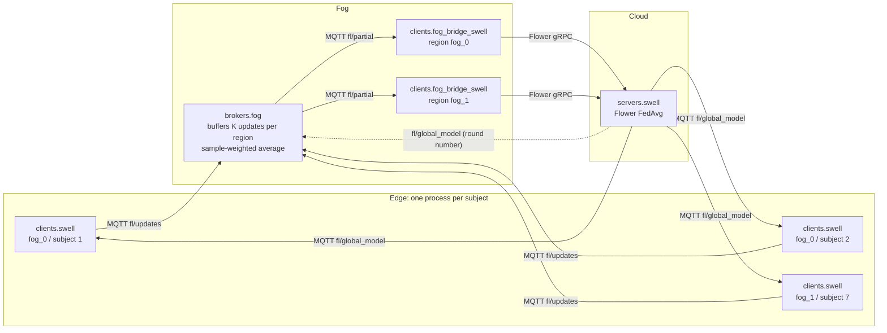

# Onion-FL

Hierarchical federated learning (edge → fog → cloud) for stress detection from wearable and workplace data, built on [Flower](https://flower.ai) and MQTT. Clients train locally on their own subject's data. Fog brokers aggregate each region over MQTT, and a Flower server aggregates the fog regions into one global model.

Onion-FL is a research prototype developed as a master's thesis (TFM). The Python package is `onion_fl` (`src/` layout); it was called `flower_basic` until the redesign.

[](https://github.com/adrianoggm/Onion-FL/actions/workflows/ci.yml)


> **About this README.** It describes the code after the phase-0 clean-up of the redesign (October 2026), and is based on an audit of the code, configs and committed result files. Every number below comes from a file in the repository, cited next to it. Numbers in earlier versions of this README that no file supports have been removed ([§7](#7-results)).

> **Redesign in progress.** Onion-FL is being refactored into a transport-agnostic framework for experimenting with FL topologies: trees of any depth, mixed-dataset fogs, pluggable learning techniques, transports and client placement, a virtual-clock simulator plus real MQTT deployments, and instrumentation at the edge, fog and global levels. The design is in [docs/superpowers/specs/2026-10-02-onion-fl-framework-design.md](docs/superpowers/specs/2026-10-02-onion-fl-framework-design.md) and the work plan is tracked as GitHub issues #73–#105, in milestones [v0.2.0](https://github.com/adrianoggm/Onion-FL/milestone/1) to v0.5.0. This README describes the code as it is today.

## Contents

1. [Project status](#1-project-status)
2. [Architecture](#2-architecture)
3. [Datasets](#3-datasets)
4. [Getting started](#4-getting-started)
5. [Configuration](#5-configuration)
6. [Observability](#6-observability)
7. [Results](#7-results)
8. [Repository map](#8-repository-map)
9. [Development and CI](#9-development-and-ci)
10. [Known issues](#10-known-issues)
11. [Roadmap](#11-roadmap)
12. [Project history](#12-project-history)
13. [License and acknowledgments](#13-license-and-acknowledgments)

---

## 1. Project status

### At a glance

| Area | Status | Summary |
|---|---|---|
| SWELL federated pipeline | ✅ Working | The full loop runs end to end. Splits are prepared, then the server, fog bridges, fog broker and one client per subject are launched. Training runs for N rounds and the global model is evaluated on held-out subjects. It is config-driven, with `just` recipes. |
| Per-region K and stale-update policy | ✅ Working (SWELL only) | Each fog has its own `k`, the number of updates it waits for before aggregating. Updates from the wrong round are either kept (`accept`) or dropped (`strict`). |
| SWEET federated pipeline | ⚠️ Partial | Runs end to end through its own launchers. There is no stale-update policy, and with the shipped `global` split the server gets no evaluation data. |
| SWEET transfer learning | ❌ Not wired | A pretrained XGBoost model is copied into each run folder, but no client or server ever loads it. |
| WESAD | ⚠️ Baselines only | Centralised baselines and subject cross-validation work. There is no federated path; the legacy ECG-era one was removed. |
| Combined WESAD + SWELL | ⚠️ Baselines only | scikit-learn only; no federated runtime. |
| ECG5000 | 🗑️ Removed | The original demo dataset had leaky splits. Its code, tests and results were deleted. |
| Observability | ✅ Working, with caveats | OpenTelemetry traces are linked across MQTT hops and shown in Jaeger. Prometheus collects metrics and a Grafana dashboard displays them. [§6](#6-observability) covers the possible duplicate series. |
| Tests | ✅ 140 tests | 136 pass; 4 skip when `data/` is absent. No MQTT broker is needed. Line coverage of `src/onion_fl` is 63%, with nothing excluded. |
| CI | ✅ Active | `ci.yml` runs `ruff check`, `ruff format --check` and `pytest` on Python 3.11. `pr-review.yml` runs a Trivy scan on PRs ([§9](#9-development-and-ci)). |
| Containerised app stack | ❌ Not available | Only the observability stack (`docker/docker-compose.otel.yml`) is containerised. Real deployment is a planned sub-project. |
| Roadmap features | ❌ Not implemented | The node registry, heartbeats, secure aggregation, signed manifests and audit trail are not built ([§11](#11-roadmap)). |

### What the results can and can't support today

- **No federated result is committed.** Federated runs write to `federated_runs/`, which is gitignored. An earlier README quoted a federated SWELL accuracy of 92.11% with no supporting artifact, so it has been removed. Reporting federated numbers needs a re-run with the run summary committed.
- **The old SWELL baselines were inflated by a label leak.** Until 2025-10-25 (commit `002246f`), the SWELL loader kept meta columns such as `blok` (the experimental block ID) as features. Accuracies near 0.99 from before that date are not valid; after the fix they fall to about 0.67 ([§7](#7-results)).
- **Only one SWELL split setup holds out whole subjects.** The code default, `per_subject`, splits each subject's own samples into train/val/test, so every test subject also appears in training. `global` combined with `test_assignments` is subject-disjoint; this is the setup in `configs/swell_federated_10runs.yaml`.
- **Cloud aggregation weights every fog equally.** Fog bridges report a fixed `num_samples=1000` to the Flower server instead of the region's real sample count.
- **SWEET models perform at the majority-class rate.** Every SWEET selection1 baseline lands at about 0.55 accuracy, which is the share of the largest class.
- **Two deleted preprocessing scripts generated synthetic data.** `process_swell_rri.py` and `process_swell_labels.py` filled most SWELL features with `np.random` values and saved them under the real SWELL file names in `data/SWELL/`. This broke the project's real-data-only rule ([docs/RULES.md](docs/RULES.md)). Both have been deleted. If either was ever run on your machine, restore `data/SWELL/` from the original download. The scripts in `validations/` check SWELL data integrity.

The full list is in [§10 Known issues](#10-known-issues).

---

## 2. Architecture

### Topology



Each box is a separate OS process, started as `python -m onion_fl.<package>.<module>`. One broker process serves every region. There is one bridge per fog node, and each bridge is a Flower `NumPyClient`. The bridges connect the MQTT side to Flower: to the server, each fog region looks like a single Flower client.

### One training round

1. The Flower server starts round *r* and calls `fit()` on every fog bridge (`min_fit_clients` equals the number of fogs).
2. Each client trains `local_epochs` epochs on its subject's `train.npz`. It evaluates `val.npz` if that file isn't empty. It then publishes its weights, sample count, loss and round number on `fl/updates`.
3. The broker buffers updates by region. Once a region has K updates, the broker computes their sample-weighted average and publishes it on `fl/partial` as a partial aggregate. It also logs norm, mean and std statistics of the averaged weights.
4. The bridge for that region takes the partial and returns it from `fit()`. If no partial arrives within 60 s, it returns the parameters unchanged.
5. The server runs FedAvg over the bridges and publishes the global model on `fl/global_model`, tagged with the round number. Clients load it and start the next round, and the broker uses the round number to classify late updates.
6. After the last round, the server evaluates the global model on the combined `test.npz` files of all fogs. It reports loss, accuracy and a confusion matrix to stdout and Prometheus. The model is not saved to disk.

### Key mechanisms

| Mechanism | How it works | Code |
|---|---|---|
| K per region | Each fog's `k` comes from the YAML. The launcher passes `--k`, or `FOG_K_MAP` (JSON) when the fogs differ. K is capped at the number of clients actually started. | `brokers/fog.py`, `federated_architecture.py` |
| Stale-update policy | The broker expects updates for round `latest_global + 1`. `accept` buffers stale or future updates and counts them; `strict` drops them. | `brokers/federated_base.py` |
| Wire format | JSON payloads; weights travel as a dict of named arrays. Every builder and decoder lives in one module. | `runtime_protocol.py` |
| Shared model per dataset | Client, bridge and server import the same model class (`SwellMLP`, `SweetMLP`) so parameter names and order match. | `swell_model.py`, `sweet_model.py` |
| Trace propagation | W3C `traceparent` travels inside each MQTT payload, and the span on the receiving side links back to it. | `telemetry.py` |
| Determinism | SWELL clients seed `random`, NumPy and torch and use deterministic algorithms. Split seeds per subject come from a CRC32 of the subject ID. Which K updates form each batch depends on MQTT arrival order, so runs are not bit-for-bit reproducible. | `clients/swell.py`, `datasets/swell_federated.py` |

### Code organisation

The April 2026 refactor (task #61) puts the shared logic for each role in a base module. Dataset-specific modules only override hooks:

| Role | Shared logic | SWELL | SWEET |
|---|---|---|---|
| Client | `clients/federated_base.py` (`FederatedMQTTClientBase`: round loop, wait for global, publish) | `clients/swell.py` | `clients/sweet.py` |
| Fog bridge | `clients/fog_bridge_base.py` (`BaseFogBridgeClient`) | `clients/fog_bridge_swell.py` | `clients/fog_bridge_sweet.py` |
| Server | `servers/federated_base.py` (`FederatedMQTTStrategyBase`, a FedAvg subclass) | `servers/swell.py` | `servers/sweet.py` |
| Broker | `brokers/federated_base.py` (`handle_client_update`, `BrokerConfig`, `BrokerCallbacks`) | `brokers/fog.py` | `brokers/sweet_fog.py` |

Shared building blocks:
- `training/local.py`: plain train and evaluate loops.
- `datasets/federated_common.py`: loads splits and manifests.
- `federated_architecture.py`: turns a YAML config into a validated plan. The pipeline is `parse_architecture_config` → `apply_manifest_paths` → `resolve_runtime_architecture` → `plan_runtime_commands`. The `plan_*` functions have no side effects.
- `scripts/run_architecture_from_config.py`: prints the plan (`--plan-only`) or launches it (`--launch`). It starts the server, then the bridges, the broker and the clients, and stops everything when the server exits. It supports SWELL only; SWEET has its own launcher.

---

## 3. Datasets

> `data/` is gitignored. Download each dataset from its original source and place it as shown below.

| Dataset | Use in this repo | Expected location | Labels | Notes |
|---|---|---|---|---|
| **SWELL** | Federated + baselines | `data/SWELL/` (or `data/SWELL/3 - Feature dataset/per sensor/`), holding the feature CSV of each modality you use: A (computer interaction), B (facial expressions), C (body posture), D (physiology). | Binary: N (no stress) = 0; T (time pressure), I (interruptions) and R (both) = 1 | 25 participants (IDs 1–25). The federated configs use the physiology modality only. In the facial CSV, the value 999 means missing. |
| **SWEET** | Federated (partial) + baselines | `data/SWEET/selection{1,2}/users/userXXXX/`, extracted from `selection{1,2}_zip/` with `scripts/extract_sweet_selection{1,2}.py`; or `data/SWEET/sample_subjects/` | Self-reported `MAXIMUM_STRESS`, mapped by one of three strategies: `binary` (≥2 means stress), `ordinal`, or `ordinal_3class` (1 / 2 / ≥3) | 14 features (7 ECG heart-rate-variability, 7 accelerometer). selection1 (102 subjects) is used for centralised baselines; selection2 for federated training. |
| **WESAD** | Baselines only | `data/WESAD/S{N}/S{N}.pkl` for subjects S2–S17 (S1 and S12 aren't in the dataset) | Binary: baseline vs stress | 15 subjects; wrist BVP, EDA, ACC and TEMP; 60 s windows with 50% overlap; 30 features (`datasets/wesad.py`). `evaluate_wesad_baseline.py` uses its own 22-feature loader. |
| Test samples | Tests | `data/samples/{wesad,swell}_real_sample.pkl` | — | Real extracts created by `scripts/create_real_samples.py`. Tests that need them skip when they're missing. |

### Federated splits

`scripts/prepare_swell_federated.py` (SWELL) and `scripts/prepare_sweet_federated.py` (SWEET) write one folder per run:

```
federated_runs/swell/<run_name>/
├── manifest.json        # fog → subjects, client → subject, split config, n_features
├── scaler_global.json   # StandardScaler fitted on the pooled training data
└── fog_0/
    └── subject_1/{train,val,test}.npz   # + val_metrics.jsonl written by the client during training
```

| Split strategy | Behaviour | Subject-disjoint? |
|---|---|---|
| `global` | Each subject goes to exactly one of train, val or test. `test_assignments` reserves named subjects per fog for the final evaluation. | ✅ Yes |
| `per_subject` (code default) | Each subject's own samples are split into train, val and test. | ❌ No |

When launching with `--manifest`, the client list in the architecture YAML is regenerated with one client per subject that has training data. Each fog's `k` is lowered to that client count if it is larger.

---

## 4. Getting started

### Requirements

- Python 3.11 or newer (CI uses 3.11).
- Docker with `docker-compose` v1 syntax, for the observability stack.
- [just](https://github.com/casey/just) (optional). Its recipes use bash, so on Windows run them from Git Bash or WSL.

### Install

```bash
python -m venv .venv
source .venv/bin/activate            # Windows: .venv\Scripts\activate
pip install -e ".[dev]"              # add ",analysis" for the baseline/analysis scripts (matplotlib, seaborn, xgboost)
```

`pyproject.toml` is the only dependency list. In CI, torch is installed from the CPU wheel index first, to avoid downloading CUDA.

### Run the tests

```bash
python -m pytest                                    # 140 tests, MQTT mocked
python -m pytest tests/test_runtime_protocol.py -q  # one file
python -m pytest -m "not slow"                      # markers: slow, integration
```

`just test` runs the same `pytest` command.

### Run the SWELL federated demo

The recommended setup is physiology features with held-out test subjects:

```bash
just docker-up               # MQTT, OTEL collector, Jaeger, Prometheus, Pushgateway, Grafana
just swell-prepare-physio    # configs/swell_federated_10runs.yaml → federated_runs/swell/10_executions_physiology/
just swell-launch-accept     # or: just swell-launch-strict
just stop-all                # stop local processes and the Docker stack
```

`just swell-demo-accept` (or `swell-demo-strict`) runs all of these steps in one command. The same flow without `just`:

```bash
(cd docker && docker-compose -f docker-compose.otel.yml up -d)
python scripts/prepare_swell_federated.py --config configs/swell_federated_10runs.yaml
MQTT_BROKER=localhost MQTT_PORT=1883 \
OTEL_EXPORTER_OTLP_ENDPOINT=http://localhost:4320 \
OTEL_EXPORTER_OTLP_METRICS_ENDPOINT=http://localhost:4320 \
python scripts/run_architecture_from_config.py \
  --config configs/federated_architecture_accept.yaml \
  --manifest federated_runs/swell/10_executions_physiology/manifest.json \
  --launch --delay 0.1
```

To print the process plan without starting anything, replace `--launch` with `--plan-only`.

| `just` recipe | What it does |
|---|---|
| `swell-prepare` | Splits with `configs/swell_federated.example.yaml` into `example_manual/`: physiology, `per_subject` split (not subject-disjoint). |
| `swell-prepare-physio` | Splits with `configs/swell_federated_10runs.yaml`: `global` split with held-out test subjects. |
| `swell-launch`, `swell-launch-physio`, `swell-launch-accept`, `swell-launch-strict` | Launch the federated stack on one of those manifests. |
| `swell-demo`, `swell-demo-light`, `swell-demo-accept`, `swell-demo-strict` | Docker up + prepare + launch. |
| `eval-wesad`, `eval-swell`, `eval-multimodal` | Centralised baselines. |
| `test`, `test-cov`, `lint`, `format`, `quality` | pytest, coverage, and ruff lint/format. |
| `stop-local`, `stop-all`, `docker-down`, `docker-clean` | Stop processes and/or containers. |
| `metrics-clear`, `status`, `info` | Pushgateway reset, port overview, environment info. |

### Run SWEET

```bash
python scripts/extract_sweet_selection2.py
python scripts/run_sweet_architecture.py --config configs/sweet_architecture_5nodes.yaml --dispatch-config --launch
```

Here `--dispatch-config` generates the splits; it doesn't publish anything over MQTT. The launcher needs a running MQTT broker and the package installed (`pip install -e .`), because it starts its child processes without setting `PYTHONPATH`. It doesn't stop the children when the server exits, so use `just stop-local`. There is no `just` recipe for SWEET.

### Run the baselines

```bash
python scripts/evaluate_wesad_baseline.py
python scripts/evaluate_swell_baseline.py
python scripts/evaluate_multimodal_baseline.py
python scripts/run_subject_cv.py --datasets wesad swell combined   # GroupKFold by subject → results/subject_cv_results/
```

The first three scripts write their JSON results to the current directory. They need the `analysis` extra.

---

## 5. Configuration

The architecture config describes the whole hierarchy (abridged from `configs/federated_architecture.example.yaml`):

```yaml
federated_architecture:
  workflow: SWELL
  dataset:                       # used by --prepare-splits when no manifest is given
    name: SWELL
    data_dir: data/SWELL
    modalities: [physiology]
    split: {train: 0.7, val: 0.15, test: 0.15, seed: 67, scaler: global, strategy: global}
    output_dir: federated_runs/swell
    run_name: 10_executions_physiology
  orchestrator:
    address: "0.0.0.0:8080"      # Flower gRPC
    rounds: 12
    stale_update_policy: accept  # accept | strict
    mqtt:
      broker: localhost
      port: 1883
      topics: {updates: fl/updates, partial: fl/partial, global_model: fl/global_model}
  model:
    type: swell_mlp
    input_dim: 16                # replaced by manifest.meta.n_features when a manifest is given
  client_params: {lr: 0.001, local_epochs: 14, seed: 46}   # defaults for every client
  fog_nodes:
    - id: fog_0
      k: 3                       # client updates per partial aggregate
      params: {local_epochs: 14} # per-fog override
      clients: [...]             # template; regenerated from the manifest
```

Parameters are merged in this order, with later ones winning: `client_params` → `fog_nodes[*].params` → `clients[*].params`.

| Config | Used for | Notes |
|---|---|---|
| `federated_architecture.example.yaml` | SWELL architecture (3 fogs, K=3, 12 rounds) | Used by `swell-launch`, `swell-launch-physio` and `swell-demo` |
| `federated_architecture_accept.yaml`, `federated_architecture_strict.yaml` | Same architecture with `accept` / `strict` stale policy | Used by `swell-*-accept` and `swell-*-strict` |
| `federated_architecture_simple.yaml` | SWELL, 4 modalities, `per_subject`, K=1, 5 rounds | No `just` recipe |
| `swell_federated_10runs.yaml` | SWELL split: 3 fogs, `global`, held-out subjects 19, 20 / 23 / 24, 25 | Recommended. Subjects 8 and 11 aren't assigned to any fog. |
| `swell_federated.example.yaml` (and `.json`) | SWELL split: 3 fogs, `per_subject` | Not subject-disjoint |
| `sweet_architecture_5nodes.yaml`, `sweet_architecture_2nodes_test.yaml` | SWEET architecture (selection2) | Only for `run_sweet_architecture.py` |
| `sweet_federated.example.yaml` | SWEET split (sample subjects, `per_subject`) | Used by `prepare_sweet_federated.py` and `run_sweet_federated_demo.py` |

Runtime environment variables: `MQTT_BROKER`, `MQTT_PORT`, `MQTT_TOPIC_UPDATES`, `MQTT_TOPIC_PARTIAL`, `MQTT_TOPIC_GLOBAL`, `FOG_K`, `FOG_K_MAP`, `FOG_STALE_UPDATE_POLICY`, `OTEL_EXPORTER_OTLP_ENDPOINT`, `OTEL_EXPORTER_OTLP_METRICS_ENDPOINT`, `METRICS_PORT_<COMPONENT>`, `PUSHGATEWAY_URL`. A template is in `docker/.env.template`.

---

## 6. Observability

`just docker-up` starts `docker/docker-compose.otel.yml`:

| Service | URL / port | Role |
|---|---|---|
| Mosquitto | `localhost:1883` (websockets on 9001) | MQTT broker for all FL traffic |
| OTEL Collector | **`localhost:4320`** (OTLP HTTP), `4319` (gRPC) | Receives traces and metrics; derives span metrics; exports to Jaeger and Prometheus |
| Jaeger | http://localhost:16686 | Traces and service dependency graph |
| Prometheus | http://localhost:9090 | Scrapes the components and Pushgateway |
| Pushgateway | `localhost:9091` | Server and client metrics pushed at shutdown |
| Grafana | http://localhost:3000 (admin/admin) | "Flower FL Dashboard", provisioned automatically |

> **Port trap.** Host port 4318 is Jaeger itself, not the collector. Traces sent there skip the collector, so no span metrics or OTLP metrics are produced. The `just` recipes and `docker/.env.template` point both endpoints at `4320`. A `.env` in the repo root or in `docker/` overrides the recipes, because the launcher and `telemetry.py` both load it.

- **Metrics.**
  - Each process serves Prometheus `/metrics`: server on `:8000`, broker on `:8001`, SWELL clients on `:8100` plus their client index. Override with `METRICS_PORT_<COMPONENT>`.
  - The SWELL server and clients also push to Pushgateway when they shut down. Brokers deliberately don't, so the live `/metrics` endpoint is the only source of broker metrics.
- **Dashboard rows.**
  - Global FL status: rounds, accuracy, loss, active clients.
  - Fog nodes: clients, aggregations and buffer per region.
  - Dataset distribution: samples per region and global split.
  - Final confusion matrix (SWELL, binary).
  - Client training rate and p95 duration.
  - Broker throughput.
- **Traces.** A round produces this chain of linked spans:
  `server.publish_global_model` → `client.receive_global_model` → `client.publish_update` → `broker.receive_update` → `broker.aggregate` → `broker.publish_partial` → `bridge.receive_partial` → `bridge.forward_to_server`.
  Flower's gRPC doesn't carry trace context, so `server.aggregate_fit` starts a new trace.

**Caveats.**
- When `OTEL_EXPORTER_OTLP_METRICS_ENDPOINT` is set, the collector exports OTLP metrics under the same `flower_fl_*` names as the native Prometheus metrics. Panels that use `sum()` may then double-count; this hasn't been verified at runtime.
- Fog bridges expose no metrics endpoint.
- The SWEET client's metrics port defaults to 9090, which collides with Prometheus.
- The confusion-matrix and dataset-split panels are filled only by the SWELL server.

---

## 7. Results

**Only results backed by a committed file are listed here.** Federated runs are not committed (see [§1](#what-the-results-can-and-cant-support-today)), so every result below is a centralised baseline. All of them live in `results/legacy/`, whose [INDEX.md](results/legacy/INDEX.md) lists each file's origin and caveats.

### WESAD: subject-disjoint holdout

Source: `results/legacy/advanced_ml_results/wesad_baseline_results.json` (`scripts/evaluate_wesad_baseline.py`). The subjects are split 7 train / 3 val / 5 test, and the 22 wrist features give 1,057 test windows.

| Model | Test accuracy | Macro-F1 | F1 (stress class) |
|---|---|---|---|
| Random Forest | 0.828 | 0.647 | 0.393 |
| SVM | 0.780 | 0.544 | 0.215 |
| Logistic Regression | 0.770 | 0.577 | 0.292 |

Macro-F1 is computed from the confusion matrices stored in the file.

### Subject-level 5-fold cross-validation (GroupKFold)

Source: `results/legacy/subject_cv_results/subject_cv_summary.json` (`scripts/run_subject_cv.py`, 2025-09-28). Values are mean ± std.

| Dataset | Model | Accuracy | Macro-F1 |
|---|---|---|---|
| WESAD | Logistic Regression | 0.865 ± 0.079 | 0.854 ± 0.087 |
| WESAD | Random Forest | 0.768 ± 0.083 | 0.738 ± 0.081 |
| SWELL (computer modality) ⚠️ | Logistic Regression | 0.951 ± 0.009 | 0.946 ± 0.009 |
| SWELL (computer modality) ⚠️ | Random Forest | 0.989 ± 0.006 | 0.987 ± 0.008 |
| WESAD + SWELL ⚠️ | Logistic Regression | 0.931 ± 0.026 | 0.928 ± 0.029 |
| WESAD + SWELL ⚠️ | Random Forest | 0.945 ± 0.033 | 0.941 ± 0.037 |

⚠️ These SWELL and combined rows predate the `blok` leak fix (2025-10-25). The last report produced after the fix (commit `791a397`, 2025-11-27; the file is no longer in the tree) gives:

| Dataset | Model | Accuracy | Macro-F1 |
|---|---|---|---|
| SWELL | Logistic Regression | 0.669 ± 0.014 | 0.422 ± 0.014 |
| SWELL | Random Forest | 0.670 ± 0.014 | 0.580 ± 0.013 |
| WESAD + SWELL | Logistic Regression | 0.697 ± 0.037 | 0.616 ± 0.047 |
| WESAD + SWELL | Random Forest | 0.695 ± 0.047 | 0.660 ± 0.060 |
| WESAD | Logistic Regression | 0.829 ± 0.056 | 0.811 ± 0.074 |
| WESAD | Random Forest | 0.809 ± 0.111 | 0.786 ± 0.127 |

Re-run `scripts/run_subject_cv.py` and commit the output before citing either table.

### SWELL: four-modality holdout

Source: `results/legacy/advanced_ml_results/swell_baseline_results.json` (`scripts/evaluate_swell_baseline.py`, 2025-12-04). It uses a random 50,000-row sample of the merged table with 163 features and a subject-disjoint 50/20/30 split. The script copies the test metrics into the "validation" block, so the file has no separate validation result.

| Model | Test accuracy | Macro-F1 |
|---|---|---|
| Random Forest | 0.573 | 0.572 |
| Logistic Regression | 0.544 | 0.544 |
| Linear SVM | 0.515 | 0.514 |

### SWEET selection1: three classes

The data has 102 subjects and 3,927 samples. The largest class accounts for **0.552** of them, so a model that always predicts it already scores 0.552.

| Model | Accuracy | Source |
|---|---|---|
| Hyperparameter search, best (XGBoost / GB) | 0.554 (CV) | `results/legacy/hypertuning_results/hypertuning_summary.json` |
| XGBoost (depth 4, 300 trees) | 0.551 ± 0.026 (subject 5-fold) | `results/legacy/baseline_models/sweet/training_report.json` |
| Gradient Boosting | 0.509 ± 0.023 (subject 5-fold) | `results/legacy/advanced_ml_results/cv_results.json` |
| KNN | 0.507 ± 0.016 (subject 5-fold) | `results/legacy/advanced_ml_results/cv_results.json` |
| SweetMLP 14→64→32→3 | 0.511 test / 0.613 val (subject holdout) | `results/legacy/baseline_models/sweet/baseline_metadata.json` |

Macro-F1 stays between 0.24 and 0.34 for every model. The "best" deep model in `results/legacy/extreme_deep_results/` predicts the majority class for all samples. On the current 14 features, no model learns more than the class prior.

### Dataset comparison

Source: `results/legacy/comparativa_completa/wesad_swell_summary.json`.

| | WESAD | SWELL (HRV table) |
|---|---|---|
| Samples | 859 windows | 410,322 rows |
| Features | 30 | 34 |
| Class balance (no stress / stress) | 557 / 302 | 222,240 / 188,082 |

`results/legacy/comparativa_completa/swell_missing_by_subject.csv` puts the overall missing-value ratio of the SWELL physiology features at 0.152.

---

## 8. Repository map

```
src/onion_fl/
├── clients/            # federated_base, fog_bridge_base, swell, sweet, fog_bridge_{swell,sweet}, baseclient
├── brokers/            # federated_base, fog (SWELL), sweet_fog
├── servers/            # federated_base, swell, sweet
├── datasets/           # swell, swell_federated, sweet_samples, sweet_federated, wesad, multimodal, federated_common, samples
├── training/local.py   # pure train/eval loops
├── federated_architecture.py, runtime_protocol.py, telemetry.py, prometheus_metrics.py
├── swell_model.py, sweet_model.py
└── evaluation.py       # subject-level CV helper for the multimodal baseline
scripts/                # launchers, data preparation, baselines (table below)
configs/                # architecture and split configs (§5)
docker/                 # observability stack, Grafana provisioning, Prometheus and collector configs
tests/                  # pytest suite (24 files)
validations/            # SWELL data-integrity checks (real vs synthetic)
results/legacy/         # committed experiment outputs from before the redesign, with INDEX.md
docs/                   # RULES.md and the redesign spec and backlog (docs/superpowers/)
```

### Scripts

| Group | Scripts | State |
|---|---|---|
| Federated, main path | `prepare_swell_federated.py`, `run_architecture_from_config.py` | ✅ Used by the `just` recipes |
| Federated, alternatives | `run_swell_federated_demo.py`; SWEET: `prepare_sweet_federated.py`, `run_sweet_architecture.py`, `run_sweet_federated_demo.py` | ✅ Run |
| Baselines | `evaluate_{wesad,swell,multimodal,sweet_sample}_baseline.py`, `run_subject_cv.py`, `train_sweet_baseline_selection1.py`, `prepare_sweet_baseline.py` | ✅ Run with the `analysis` extra. `prepare_sweet_baseline.py` needs `--data-dir data/SWEET/selection1/users`. They will become the `onion_fl baseline` command in the redesign. |
| Data extraction | `extract_sweet_selection{1,2}.py`, `create_real_samples.py` | ✅ |

The analysis scripts that produced the WESAD-vs-SWELL comparison live next to their outputs in `results/legacy/comparativa_completa/`.

---

## 9. Development and CI

```bash
ruff check .            # CI gate
ruff format --check .   # CI gate
python -m pytest        # CI gate
just format             # ruff check --fix + ruff format
```

- **Style.** ruff for lint and formatting, 88 columns. Modules start with `from __future__ import annotations`. Log and CLI messages are mostly in Spanish.
- **Rules.** [docs/RULES.md](docs/RULES.md): real data only, subject-disjoint evaluation, no meta columns as features, results must cite a committed artifact.
- **Branches and commits.** Each GitHub issue gets a `task/#N` branch from `develop` and a PR back into `develop`. `main` only receives tagged working versions. Commit messages follow `type(scope): Imperative summary in English`. The full procedure, plus a GitHub API helper that needs no `gh` CLI, is in [.claude/skills/tarea-github/SKILL.md](.claude/skills/tarea-github/SKILL.md).

| Workflow | Trigger | What it does |
|---|---|---|
| `ci.yml` | PRs into `main` (`develop` → `main` releases) and manual dispatch | `ruff check`, `ruff format --check` and `pytest` on Python 3.11 |
| `pr-review.yml` | PRs into `main` | Trivy filesystem scan, uploaded to GitHub code scanning |
| `codeql.yml` | PRs into `main` and manual dispatch | CodeQL analysis. GitHub disabled it for inactivity; it has to be re-enabled from the Actions tab. |
| Dependabot | Weekly | Dependency and action updates, opened against `develop` |

To save CI minutes, workflows only run on release PRs into `main`. Task PRs into `develop` are gated by running the same checks locally (`just lint` and `just test`).

---

## 10. Known issues

These are the open problems in the current code. Most are addressed by the redesign; see the [v0.2.0 milestone](https://github.com/adrianoggm/Onion-FL/milestone/1) for where each one is fixed.

### Validity of results

- **Federated results are missing.** No federated run summary is committed, and no `metrics_summary.json` writer exists.
- **SWELL leakage risks:**
  - The default `per_subject` split is not subject-disjoint.
  - The loader fills missing values with dataset-wide means and drops zero-variance columns before splitting.
- **Cloud FedAvg ignores region size.** The bridges report `num_samples=1000` for every fog (`clients/fog_bridge_base.py`).
- **Partials can be lost.** When K is smaller than the number of clients in a fog, the broker emits several partials per round. The bridge keeps only the latest, and extras spill into the next round.
- **The global model is evaluated only once.** Evaluation happens after the final round, the training history isn't written to disk, and the global model isn't saved.
- **The SWEET XGBoost baseline leaks.** Its scaler is fitted on all of selection1 before cross-validation.
- **`val_metrics.jsonl` accumulates across runs.** It is opened in append mode, and with the `global` split train subjects only log `train_loss`.

### SWEET

- **Transfer learning isn't connected.** The pretrained XGBoost model and `baseline_model.pth` are never loaded as initial weights.
- **The `global` split leaves fogs without val/test data**, so the server has nothing to evaluate.
- **`per_subject` splits aren't reproducible.** They are seeded with Python's `hash()`, which changes per process.
- **No stale-update policy** and no round metadata in the SWEET broker.
- **The SWEET client:**
  - has no seeding;
  - writes no `val_metrics.jsonl`;
  - waits 60 s for a first global model that never arrives;
  - crashes on shutdown, because it calls `push_metrics_to_gateway()` without its required `job` argument.

### Launchers

- **No readiness wait in the SWELL launch.** The SWELL server command has no `--server_addr`, so the launcher's readiness check never runs and `--delay` is the only gap between launches.
- **The plan dispatch has no listener.** `--dispatch-config` publishes to `fl/ctrl/plan/<fog_id>`, but nothing subscribes.
- **The SWEET launcher doesn't stop its children** when the server exits, and needs the package installed because it doesn't set `PYTHONPATH`.

---

## 11. Roadmap

Status of the components from the original design notes. The redesign spec covers the next steps.

| Component | Status |
|---|---|
| Hierarchical edge → fog → cloud aggregation over MQTT + Flower | ✅ Implemented |
| Per-region aggregation thresholds (K) and stale-update handling | ✅ Implemented (SWELL) |
| End-to-end tracing and metrics | ✅ Implemented |
| Dataset distribution | ⚠️ Partial: offline materialisation of NPZ shards plus a manifest on a shared filesystem. No shard transfer, tokens or receipts. |
| MQTT control topics | ⚠️ Partial: only `fl/updates`, `fl/partial`, `fl/global_model` and a publish-only `fl/ctrl/plan/*` |
| Node registry and dynamic discovery | ❌ Not implemented (nodes are static, from config/manifest) |
| Heartbeats | ❌ Not implemented |
| Fog-aware FedAvg strategy | ❌ Not implemented (plain FedAvg, equal fog weights) |
| Traceability and audit trail | ❌ Not implemented (OTEL tracing is observability, not audit) |
| Secure aggregation, TLS, encryption | ❌ Not implemented: weights travel as plaintext JSON, Mosquitto allows anonymous clients, and the broker sees every individual update |
| Signed manifests | ❌ Not implemented |
| Differential privacy, FedProx, FedNova | ❌ Not implemented |
| Two-phase encoder/head training | ❌ Not implemented |
| Global model versioning and storage | ❌ Not implemented |

---

## 12. Project history

| Period | Milestone |
|---|---|
| 2025-07 | First Flower FedAvg + Mosquitto prototype; fog-node aggregation; ECG5000 CNN demo with CI |
| 2025-09 | Real WESAD and SWELL loaders; real-data-only policy; ECG5000 deprecated |
| 2025-10 | SWELL federated partitioning safeguards; meta columns (`blok`, …) excluded from features; validation-metrics logging |
| 2025-11 | First working federated SWELL run; package restructured into `clients/`, `brokers/`, `servers/` |
| 2025-12 | OpenTelemetry + Jaeger + Prometheus + Grafana stack; SWEET baselines, model sweeps and first SWEET federated version |
| 2026-01 | Architecture diagrams; configurable training parameters; seed reproducibility; repository clean-up; Apache-2.0 licence |
| 2026-03 | Lint/format pass; fix for duplicate child processes; `justfile`; `accept`/`strict` stale-update policy (PR #60) |
| 2026-04 | Pure-function refactor (PR #62, task #61); shared client/broker/server/data base modules; OTEL metrics fix (`8eeaa8a`) |

---

## 13. License and acknowledgments

Licensed under the Apache License 2.0; see [LICENSE](LICENSE).

- **Datasets:** WESAD (Schmidt et al.), SWELL (Koldijk et al.) and SWEET.
- **Software:** [Flower](https://flower.ai), [PyTorch](https://pytorch.org), [Eclipse Mosquitto](https://mosquitto.org), [OpenTelemetry](https://opentelemetry.io), [Prometheus](https://prometheus.io), [Grafana](https://grafana.com) and [Jaeger](https://www.jaegertracing.io).
