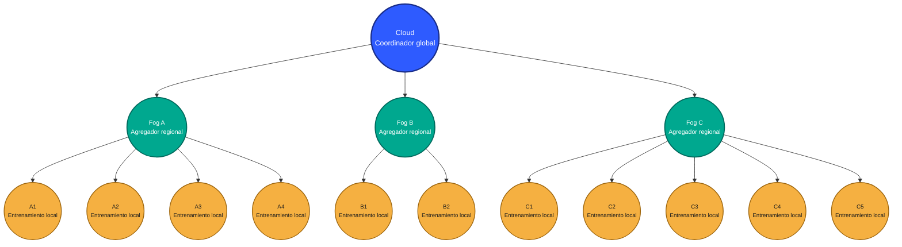

EC2((C2<br/>Entrenamiento local)):::edge
EC3((C3<br/>Entrenamiento local)):::edge
EC4((C4<br/>Entrenamiento local)):::edge
EC5((C5<br/>Entrenamiento local)):::edge

%% --- Árbol ---
C --> FA
C --> FB
C --> FC

FA --> EA1
FA --> EA2
FA --> EA3
FA --> EA4

FB --> EB1
FB --> EB2

FC --> EC1
FC --> EC2
FC --> EC3
FC --> EC4
FC --> EC5

%% =========================
%% Estilo visual (tamaños + colores)
%% =========================
classDef cloudBig fill:#2E5BFF,stroke:#1A2E8A,stroke-width:2.5px,color:#ffffff,font-size:14px;
classDef fog      fill:#00A88F,stroke:#00695C,stroke-width:2px,color:#ffffff,font-size:12px;
classDef edge     fill:#F5B041,stroke:#9C640C,stroke-width:1.5px,color:#1C1C1C,font-size:11px;

linkStyle default stroke:#555,stroke-width:1.5px;
```