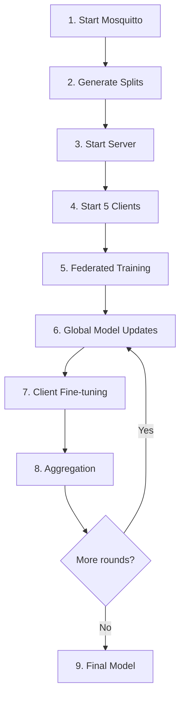

# SWEET Federated Learning - Guía Rápida de Ejecución

## 🚀 Inicio Rápido (3 Pasos)

### Paso 1: Iniciar MQTT Broker (Terminal 1)

```bash
# Windows
start_mosquitto.bat

# Linux/Mac
mosquitto -c mosquitto.conf
```

**¡IMPORTANTE!**: Deja esta terminal abierta. Mosquitto debe estar corriendo durante todo el entrenamiento federado.

### Paso 2: Ejecutar Sistema Federado (Terminal 2)

```bash
# Activar entorno virtual
.venv\Scripts\activate  # Windows
# source .venv/bin/activate  # Linux/Mac

# Generar splits y lanzar sistema (5 nodos fog)
.venv\Scripts\python.exe scripts\run_sweet_architecture.py ^
  --config configs\sweet_architecture_5nodes.yaml ^
  --dispatch-config ^
  --launch
```

### Paso 3: Observar Entrenamiento

El sistema iniciará:
- ✅ 1 servidor central (agregación FedAvg)
- ✅ 5 clientes fog (1 por nodo)
- ✅ 10 rounds de entrenamiento federado

## 📋 Opciones de Ejecución

### Opción A: Todo Automático (Recomendado)
```bash
# Genera splits + lanza sistema
python scripts\run_sweet_architecture.py ^
  --config configs\sweet_architecture_5nodes.yaml ^
  --dispatch-config ^
  --launch
```

### Opción B: Paso a Paso
```bash
# 1. Solo generar splits
python scripts\run_sweet_architecture.py ^
  --config configs\sweet_architecture_5nodes.yaml ^
  --dispatch-config

# 2. Luego lanzar (usa splits existentes)
python scripts\run_sweet_architecture.py ^
  --config configs\sweet_architecture_5nodes.yaml ^
  --launch
```

### Opción C: Usar Manifest Existente
```bash
python scripts\run_sweet_architecture.py ^
  --config configs\sweet_architecture_5nodes.yaml ^
  --manifest federated_runs\sweet\auto_5nodes\manifest.json ^
  --launch
```

## ⚙️ Configuración

Edita `configs/sweet_architecture_5nodes.yaml` para ajustar:

- **Número de nodos fog**: `num_fog_nodes: 5`
- **Rounds federados**: `rounds: 10`
- **Learning rate**: `lr: 0.001`
- **Arquitectura del modelo**: `hidden_dims: [64, 32]`
- **Splits**: `train/val/test: 0.6/0.2/0.2`

## 📊 Resultados

Los resultados se guardan en:
```
federated_runs/sweet/auto_5nodes/
├── manifest.json                 # Configuración y metadata
├── pretrained_model.json         # Modelo base de selection1
├── pretrained_scaler.json        # Scaler de normalización
├── fog_0/                        # Datos del nodo 0
│   ├── train.npz                 # ~24 sujetos
│   ├── val.npz
│   └── test.npz
├── fog_1/                        # Datos del nodo 1
├── fog_2/                        # Datos del nodo 2
├── fog_3/                        # Datos del nodo 3
└── fog_4/                        # Datos del nodo 4
```

## 🔍 Verificación

### Comprobar que Mosquitto está corriendo
```bash
# Windows PowerShell
Test-NetConnection localhost -Port 1883

# Linux/Mac
nc -zv localhost 1883
```

### Ver logs del servidor
El servidor mostrará:
```
[SERVER_SWEET] Initialized with test set: XX samples
[SERVER_SWEET] MQTT connected (rc=Success)
[SERVER_SWEET] Broadcasted initial global model
[SERVER_SWEET] Running... (Ctrl+C to stop)
```

### Ver logs de clientes
Cada cliente mostrará:
```
[SWEET_CLIENT_fogX_client] MQTT connected (rc=Success)
[SWEET_CLIENT_fogX_client] Initialized with XXX train, XXX val samples
[SWEET_CLIENT_fogX_client] Running... (Ctrl+C to stop)
```

## ❌ Troubleshooting

### Problema: "Se queda pillado después de inicializar clientes"

**Causa**: Mosquitto no está corriendo

**Solución**:
1. Abre **terminal separada**
2. Ejecuta: `start_mosquitto.bat` (Windows) o `mosquitto -c mosquitto.conf`
3. Vuelve a ejecutar el sistema federado

### Problema: "Connection refused" al puerto 1883

**Solución 1** (Instalar Mosquitto):
```bash
# Windows: Descargar de https://mosquitto.org/download/
# Ubuntu/Debian:
sudo apt-get install mosquitto mosquitto-clients
# macOS:
brew install mosquitto
```

**Solución 2** (Usar Docker):
```bash
docker run -d -p 1883:1883 --name mosquitto eclipse-mosquitto
```

### Problema: "ValueError: Incorrect label names"

**Ya corregido**. Si aún aparece, verifica que `src/flower_basic/clients/sweet.py` tenga:
```python
CLIENT_TRAIN_SAMPLES.labels(client_id=self.client_id, region=self.node_id)
```

### Problema: Los clientes no reciben modelo global

**Causa**: Mosquitto no está corriendo o hay problema de red

**Solución**:
1. Verifica mosquitto: `Test-NetConnection localhost -Port 1883`
2. Revisa logs del servidor para confirmar "Broadcasted initial global model"
3. Asegúrate que no hay firewall bloqueando puerto 1883

## 📝 Características del Sistema

### Distribución de Datos (5 Nodos)
- **Total**: 120 sujetos de selection2
- **Por nodo**: ~24 sujetos
- **Splits**: 
  - Train: 72 sujetos (60%)
  - Val: 24 sujetos (20%)
  - Test: 24 sujetos (20%)

### Subject-Level Splitting (ESTRICTO)
✅ Si un sujeto está en TRAIN → **TODOS** sus datos son TRAIN  
✅ Si un sujeto está en VAL → **TODOS** sus datos son VAL  
✅ Si un sujeto está en TEST → **TODOS** sus datos son TEST  

**NO hay mezcla de datos** entre splits del mismo sujeto.

### Transfer Learning
- ✅ Modelo pre-entrenado en selection1 (102 sujetos, 55.12% acc)
- ✅ Fine-tuning en selection2 (140 sujetos, 5 nodos fog)
- ✅ Learning rate reducido: 0.1x (fine-tuning)

### Arquitectura
- **Modelo**: SweetMLP (PyTorch)
- **Input**: 14 features fisiológicas
- **Hidden**: [64, 32]
- **Output**: 3 clases (ordinal_3class: low/medium/high stress)
- **Optimizador**: Adam (lr=0.001)
- **Loss**: CrossEntropyLoss

## 🎯 Flujo Completo



## 📚 Más Información

- **Guía completa**: `SWEET_TRANSFER_LEARNING_README.md`
- **Configuración YAML**: `configs/sweet_architecture_5nodes.yaml`

## ⏱️ Tiempo Estimado

- Generar splits: ~30 segundos
- Por round federado: ~2-3 minutos
- **Total (10 rounds)**: ~20-30 minutos

---

**¿Problemas?** Asegúrate de que mosquitto está corriendo ANTES de ejecutar el sistema federado.
