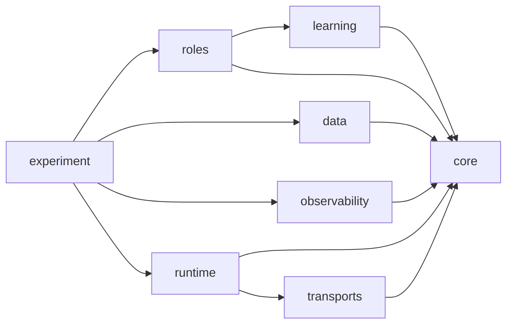
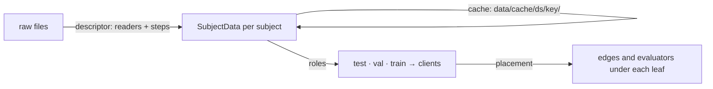
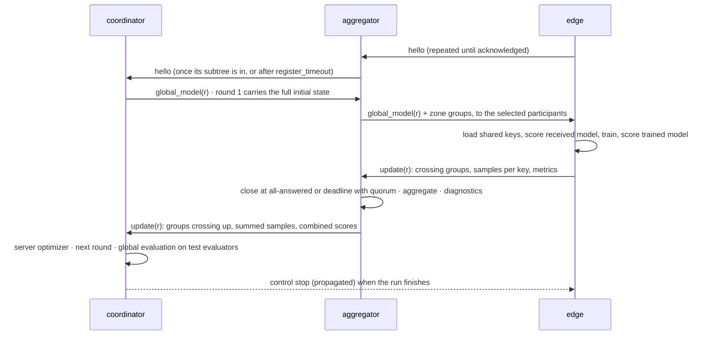

# Onion-FL architecture

This document describes the framework as built in v0.2.0. The design it implements, with the decisions and their reasons, is the spec in [superpowers/specs/2026-10-02-onion-fl-framework-design.md](superpowers/specs/2026-10-02-onion-fl-framework-design.md) (Spanish). The rules that protect the validity of results are in [RULES.md](RULES.md).

## 1. Principles

1. **Nodes are state machines.** A node reacts to `on_start`, `on_message` and `on_timer`. It reaches the world only through a `Context`: `send`, `set_timer`, `cancel_timer`, `now`, `rng`, `emit` and `compute`. The same node therefore runs in the simulator and over real transports.
2. **Every experimental axis is a plugin.** A plugin is chosen by name, or by `package.module:Name`, with pydantic-validated parameters. Its metadata (title, description, parameters and explanation) feeds the JSON Schema that the front will use.
3. **Nothing generic knows a dataset.** `roles/`, `learning/`, `runtime/` and `core/` never name SWELL, SWEET or WESAD, and a test enforces it. Datasets enter only through descriptors and `SubjectData`.
4. **Everything is measured and signed.** Each run leaves its events, a summary and the final model, under identifiers that tie a number to the topology, config, data and code that produced it.

## 2. Packages



| Package | Modules | Role |
|---|---|---|
| `core` | `message`, `codec`, `node`, `context`, `topology`, `registry`, `ids` | Messages and their encoding, the node contract, topologies and identifiers, plugin registries |
| `data` | `contract`, `ingest`, `cache`, `roles`, `placement` | From raw files to the data under each leaf aggregator |
| `learning` | `model`, `sharing`, `aggregators`, `trainers`, `metrics` | What is trained, what travels, how it is combined and scored |
| `roles` | `nodes`, `policies`, `federation` | The round protocol and the assembly of a federation on a runtime |
| `runtime` | `sim`, `real`, `network`, `devices` | Virtual-clock and wall-clock hosts for the nodes |
| `transports` | `memory`, `mqtt` | Bytes between processes for the real runtime |
| `observability` | `events`, `run`, `diagnostics`, `analysis`, `sinks` | Event schema, run records, diagnostics, analysis and live sinks |
| `experiment` | `config`, `sweep`, `runner`, `real`, `cli` | From an experiment YAML to signed runs |

## 3. Topology

A topology is a validated tree:
- one root (the coordinator);
- aggregators on every level in between;
- a last level of edges that the placement creates.

It is written compactly, as a block per level with `defaults` and `nodes`, or as a general list of nodes; the compact form compiles to the general one. Each link has a transport, a codec and a network profile. Node settings carry the round settings: aggregator, quorum, deadline, participation, staleness, evaluation and diagnostics.

`topology_id` is the SHA-256 of the canonical tree: levels, nodes with their level, role, parent and link, and the edge link. It ignores names, declaration order and settings. `to_graph()` exports the JSON the report and the front draw, and `onion_fl topology show --mermaid` prints a Mermaid flowchart ([diagrams/](diagrams/)).

## 4. Data



- **Descriptors** (`datasets/<name>.yaml`) declare a source with readers (`csv`, `excel`, `parquet`, `pickle`, `npz`, `wesad_pickle`) and ordered steps (`subject`, `label`, `features`, `replace`, `join`, `window`, `select`). Options fill `{placeholders}` and switch steps on with `when`. Each source file runs through the steps on its own, so memory stays bounded and windows never span two files. The `subject` and `label` source columns can never become features, and `features` must be explicit.
- **The cache** stores one `npz` per subject plus `meta.json` with a digest per subject. Its key hashes the descriptor and the options, not the root path. Parallel writers are safe.
- **Roles** are drawn per dataset with their own seed, before and apart from the placement:
  - `test` subjects are the global evaluators, and they are identical in every scenario;
  - `val` subjects become zone evaluators;
  - `train` subjects are grouped into clients (`subjects_per_client`), each keeping `local_val` rows: its last rows (`tail`) or the last rows of each class (`class_tail`);
  - imputation, scaling (`global`, `local` or `none`) and constant-feature removal are fitted on the training portions only.
- **Placement** gives each leaf aggregator its clients and its zone evaluators:
  - `mixing(α)` weights each dataset by home fog (declared, inherited or assigned in turns), from segregated at α = 0 to uniform at α = 1;
  - the others are `dirichlet(β)`, `label_skew(β)`, `explicit` and `pooled`, the centralised baseline with the same model and trainer.
  - The composition per leaf (samples, classes, dataset mix and its entropy) is recorded as `data.composition`.

## 5. Learning

**Model.** `modular_mlp` holds an adapter per dataset (or one shared adapter over harmonised features), a shared or per-dataset trunk, and a head per task or per dataset. Its parameter keys are namespaced (`adapter.<ds>.*`, `trunk.*`, `head.<task>.*`), so an edge instantiates only its own parts. Every layer is initialised from (seed, layer path), so a part starts identical everywhere.

**Sharing.** Each parameter group has a scope:

| Scope | Meaning |
|---|---|
| `global` | Aggregated up to the coordinator |
| `level:<name>` | Aggregated up to that level; its aggregator keeps it and injects it into what it sends down |
| `local` | Never leaves the edge |

A group crosses a link, in both directions, when its scope is `global`, or `level:X` with X at the parent's level or above it. The presets are `fedavg`, `fedper` (local heads), `lg_fedavg` (local adapters and trunk, global heads), `zone(level)`, `independent` and `harmonized`; `custom` takes rules by glob.

**Aggregation.** Aggregators work per key, only among the contributions that hold it, and send up the summed samples, so a tree of `fedavg` equals a flat FedAvg. Contributions are sorted by sender before combining. The aggregators are `fedavg`, `mean`, `median` and `trimmed_mean(β)`. The coordinator then applies a server optimizer, `replace`, `fedavgm`, `fedadam`, `fednova` or `feddyn`, with the round's statistics. These are `train_*` metrics reduced up the tree (steps and loss averaged by examples, examples and edges summed) plus `edges_total`. `learning.server_optimizer` overrides the topology's root setting. A server optimizer is called as `apply(global_state, aggregated, stats)`; one written for the old two-argument form needs the third.

**Auxiliary arrays.** A trainer can return arrays named `<algorithm>/<parameter key>`, for example SCAFFOLD's control variates or FedNova's normalised update. They travel where their parameter travels and are combined per key. Server optimizers replace them instead of stepping them, and diagnostics ignore them.

**Training and initialisation.**
- Trainers: `standard` (epochs, batch, learning rate, optimizer, frozen groups) and `fedprox(μ)`.
- Drift trainers: `scaffold` (control variates as auxiliary arrays), `moon` (contrast on `ModularMLP.features`), and the pairs `fednova` and `feddyn` (trainer + server optimizer, checked before the first scenario). An edge whose training leaves non-finite weights reports `edge.train_failed` and sends nothing.
- Personalisation trainers: `ditto(λ)` and `apfl(α)` keep a personal model per edge across rounds and expose it through `personal()`. `fedrep` trains the local head, then the shared body, and declares the head as `local_groups`: `plan` refuses a sharing policy that sends it up. `fedbabu` freezes the head.
- `stub` learns nothing and is for protocol tests; with `noise` each node sends a different, seeded update.
- Inits: `random(seed)`, and `checkpoint(path, groups)`, which loads a saved `model.npz` such as a pooled run's.

**Metrics.** `loss`, `accuracy`, `macro_f1`, `recall_per_class` and `confusion_matrix` give scalars. When reports are combined, scores are averaged by samples and confusion counts are summed.

## 6. Round protocol



- **Registration.** A child repeats its `hello` until the parent acknowledges it, so a lost message does not stall the tree.
- **Closing a round.** A round closes when every participant has answered, or when the deadline passes with quorum (an int is a count, a float a fraction). Without quorum, the aggregator sends an empty update and emits `round.quorum_failed`.
- **Late updates.** They go to a staleness plugin: `drop`, or `next_round` with a `constant` or `polynomial` weighting.
- **Participation.** It is `all`, or `fraction(p)` drawn with the node's own RNG stream.
- **Failures.** A failed training is `edge.train_failed`, and the edge counts as absent. A malformed message, or one from an unknown sender, is `message.rejected`. No node error stops a run.
- **Evaluation.**
  - Edges score their `local_val` every `edge.every` rounds: the model received and the one trained, plus `personal` (if the trainer has a personal model) and `finetuned` (the received model after the `edge.finetune` trainer, which draws from a child random stream so it never changes training).
  - Aggregators combine the scores of their children, and ask their `val` evaluators to score the zone model every `aggregators.every` rounds.
  - The coordinator asks the `test` evaluators to score the global model every `global.every` rounds, and always after the last one. It reports per dataset.

## 7. Runtimes and transports

**SimRuntime.**
- One queue ordered by (virtual time, sequence), with `start`, `deliver`, `timer` and `compute_done` events.
- Links schedule each direction FIFO, with latency (fixed, normal or lognormal), jitter, bandwidth and loss; the presets are `lan`, `wifi`, `4g` and `lora`.
- `ctx.compute(samples)` keeps a node busy for the time its compute model gives. What it sends leaves when the work ends, and what arrives meanwhile waits.
- Availability is `always`, `bernoulli`, `schedule` or `crash_at`.
- Each node keeps one RNG stream for the whole run, so a seed gives the same events.

**RealRuntime.**
- The same `Context` on the wall clock, with one loop thread.
- A process hosts its group of nodes and knows the others only to declare links.
- Messages carry `msg_id` and `sent_at` in `meta`, so the receiver records the same id and the end-to-end latency.
- Every node emits `node.heartbeat`.

**Transports.** `mqtt` gives each node an inbox at `onionfl/<run_id>/<node>/inbox`, with QoS and broker per link; it reconnects and resubscribes after a broker restart. `memory` is an in-process bus for tests.

**Real runs.**
1. `onion_fl run --mode real` checks the brokers.
2. It writes `scenario.json` and starts one `onion_fl node` process per group: the root with the test evaluators, and each aggregator with its edges.
3. Each process rebuilds the same scenario and writes its own event file.
4. When the run finishes, a stop travels down the tree, the processes exit, and the launcher merges and signs the run.

With full quorum and the same seed, simulation and MQTT give the same final model. `tests/test_runtime_equivalence.py` checks it.

## 8. Observability

**Event schema.** Every event becomes:

```
{t_virtual, t_wall, run_id, topology_id, scenario, seed, round, level, node, role, kind, name, value, tags}
```

`kind` is `metric`, `message`, `lifecycle`, `diagnostic` or `data`.

**Identity.**

| Identifier | Definition |
|---|---|
| `topology_id` | SHA-256 of the canonical tree |
| `config_id` | SHA-256 of the validated config without seeds and sweep |
| `data_id` | SHA-256 of the cache digests in use |
| `code_version` | Git commit, and whether there were uncommitted changes |
| `run_id` | `<UTC date>-<sha12>` over the config, seed, clock, host, PID and random bytes |
| `run_hash` | SHA-256 of `run.json`, `events.jsonl`, `summary.json` and `model.npz` |

**Diagnostics** run at each aggregator when it closes a round:
- divergence, conflict between datasets, drift and zone distance;
- participation and fairness;
- communication, derived by the run recorder from the message events.

**Analysis and report.** `load_runs(...).metrics(...)` gives one row per event with every tag as a column. `.compare(level, metric, by, over="seed")` combines the nodes of a level inside each run (mean, min, max and spread), then the runs over the seeds, with a 95% t interval per round. `report()` and `onion_fl report` render it as HTML.

**Sinks.**
- `jsonl` is always on.
- `prometheus` serves the `onionfl_*` series that the Grafana dashboard queries; a test keeps the dashboard and the series in sync.
- `otel` creates one span per send and per receive, linked by `msg_id`. It exports over OTLP to the collector.

## 9. Studio

`onion_fl serve` starts Onion-FL Studio: a FastAPI app (`onion_fl.studio.api`) over the same files as the command line, plus a single-page app in `studio/static/`. The app is plain JavaScript and SVG, with no build step and no dependencies.

| Area | What it shows |
|---|---|
| Topologies | The library with graphs and `topology_id`, and an editor that validates through `POST /api/topologies/validate` |
| Experiments | Scenarios with their `config_id`, the dry-run plan with its warnings, and a launch that starts `onion_fl run` in a child process |
| Runs | Status, identity, summary, metric series per level, and events polled every two seconds while a run is `running` |
| Compare | `Runs.compare` by any tags, with the 95% CI band |
| Tutorial | Every registry's plugins with their explanation and parameters, and dry-run previews (`studio.previews`) |

The previews are pure functions:
- sharing builds a model with placeholder shapes and lists the groups per link;
- placement runs the plugin on hypothetical subject counts;
- the network preview samples a link profile.

Names are checked against a safe pattern so that no request leaves its folder. Responses are never cached, because files change under a running Studio. The design is in [superpowers/specs/2026-10-03-onion-fl-studio-design.md](superpowers/specs/2026-10-03-onion-fl-studio-design.md).

## 10. Extending

**Adding a plugin.** Register a class or a function in its registry, with a pydantic model for its parameters. The new plugin then shows up in the config validation, in `onion_fl schema` and in the front.

```python
from pydantic import BaseModel, Field
from onion_fl.learning.aggregators import aggregators

class GeoParams(BaseModel):
    iterations: int = Field(10, gt=0)

@aggregators.register("geometric_median", title="Geometric median", description="…", params=GeoParams)
class GeometricMedian:
    def __init__(self, iterations: int = 10) -> None:
        self.iterations = iterations

    def aggregate(self, contributions, source):
        ...
```

Outside the package, a config can name a plugin as `my_package.my_module:GeometricMedian`.

| Registry | Built-ins |
|---|---|
| codec | `json`, `npz` |
| link_profile | `lan`, `wifi`, `4g`, `lora` |
| compute_model | `samples_per_second`, `measured` |
| availability_model | `always`, `bernoulli`, `schedule`, `crash_at` |
| transport | `memory`, `mqtt` |
| model | `modular_mlp` |
| sharing | `fedavg`, `fedper`, `lg_fedavg`, `zone`, `independent`, `harmonized`, `custom` |
| aggregator | `fedavg`, `mean`, `median`, `trimmed_mean` |
| server_optimizer | `replace`, `fedavgm`, `fedadam`, `fednova`, `feddyn` |
| trainer | `standard`, `fedprox`, `ditto`, `apfl`, `fedrep`, `fedbabu`, `scaffold`, `fednova`, `feddyn`, `moon`, `stub` |
| init | `random`, `checkpoint` |
| metric | `loss`, `accuracy`, `macro_f1`, `recall_per_class`, `confusion_matrix` |
| diagnostic | `divergence`, `dataset_conflict`, `drift`, `participation`, `fairness` |
| participation | `all`, `fraction` |
| staleness | `drop`, `next_round` |
| stale_weighting | `constant`, `polynomial` |
| placement | `explicit`, `mixing`, `dirichlet`, `label_skew`, `pooled` |
| reader | `csv`, `excel`, `parquet`, `pickle`, `npz`, `wesad_pickle` |
| step | `subject`, `label`, `features`, `replace`, `join`, `window`, `select` |
| baseline | `lr`, `rf`, `xgboost` |
